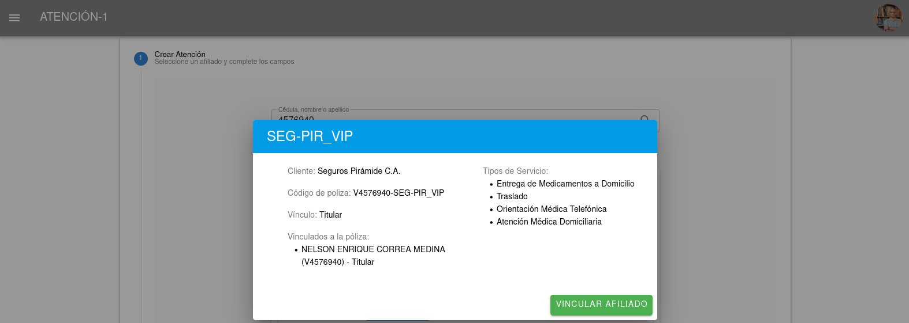
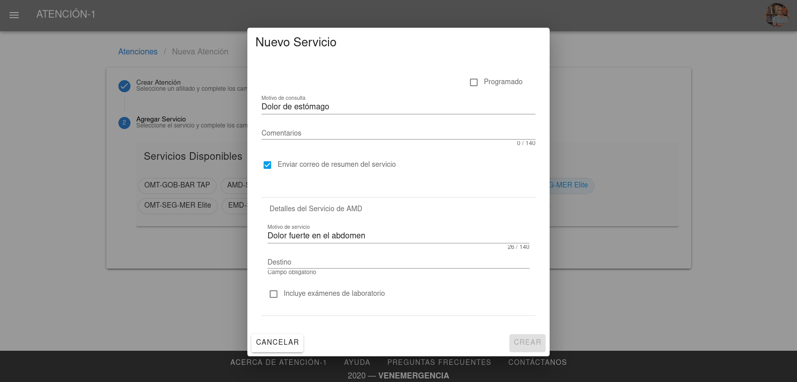

##########
Operador/a
##########

El Operador es la persona que atiende las llamadas telefónicas y agrega la información del afiliado y su solicitud en la plataforma Atención-1. Recuerda que si quieres conocer los conceptos utilizados en la plataforma Atención-1, puedes revisar este :ref:`glosario` que hemos preparado.

Para ingresar a la plataforma como Operador, debemos escribir en la barra de dirección de nuestro navegador:
https://atencion1.venedigital.com. Una vez allí veremos en la barra inferior información acerca de Atención-1, un enlace con ayuda que contendrá un manual, una guía de Preguntas Frecuentes y enlace a un correo electrónico con el que se podrá contactar al equipo de desarrollo.

.. image:: ../images/Operador/PantallaInicialAtencion1.png
    :width: 700

Para ingresar debemos indicar el nombre y contraseña del usuario, en este caso Operador. Una vez dentro de la plataforma, vemos varios elementos: en la parte superior del lado derecho tenemos el acceso a los datos del perfil del usuario que acaba de ingresar. Del lado superior izquierdo tenemos el menú donde podemos acceder más fácilmente al panel de atenciones. Y en la parte central, se encuentra el panel de atenciones. Una atención es un conjunto de servicios ofrecidos a titulares o beneficiarios de pólizas de seguros. Este panel se encuentra dividido en cuatro secciones: 

#. Atenciones en espera.
#. Atenciones próximas programadas: en esta sección se encuentran todos los PHD o servicios AMD/LAB/TLD/EMD programados.
#. Atenciones en progreso: esta sección muestra los servicios que actualmente están siendo atendidos.
#. Atenciones por cerrar. 

.. image:: ../images/Operador/OperadorPanelAtencionesGeneral1.png
    :width: 800
       
.. image:: ../images/Operador/OperadorPanelAtencionesGeneral2.png
    :width: 700

visualizando los círculos de color ubicados en la parte superior del panel de atenciones, podemos saber cómo se encuentra o cuál es el estatus de cada servicio por medio de un color determinado:

#. El color amarillo indica un **servicio abierto**.
#. El color verde es un **servicio en proceso**.
#. El color azul es un **servicio completado**.
#. El color gris oscuro indica un **servicio cerrado**.
#. El color gris claro indica un **servicio cancelado**.
#. El color rojo que incluye una advertencia con un signo de admiración indica un **servicio retrasado**.

.. _crear-atencion:

******************
Crear una atención
******************

Al atender una llamada, lo primero que debemos hacer es proceder a crear una **atención**. Para hacerlo: 

#. Hacemos clic en el círculo de color verde con un signo "+" en su interior.
#. A continuación en el recuadro que contiene el símbolo de la lupa, introducimos la cédula o el nombre de la persona que solicita ser atendida. Atención-1 permite realizar búsquedas con número de cédula o nombre, parcial o completo, de la persona afiliada.
#. Al pulsar Enter o hacer clic sobre la lupa, obtendremos los resultados de la búsqueda en la base de datos del sistema. El sistema está configurado para realizar una búsqueda simultánea en su base de datos y en la información del *Validador*. En caso de no estar registrado un afiliado/a, el sistema permitirá ingresar los datos de una nueva persona afiliada a través de la opción :ref:`crear-afiliado`. En caso contrario, deberá seleccionarse de la lista desplegada, cuál es el afiliado o la afiliada a atender. 

    **IMPORTANTE: Atencion-1 contempla dos tipos de afiliados: Titular y Afiliado vinculado. Cada titular cuenta con, al menos, una póliza y los Afiliados vinculados pueden o no tener cédula de identidad. Sólo puede haber un títular por póliza. La póliza es la especificación del conjunto de servicios sanitarios incluidos en el plan de cada Afiliado títular junto con su grupo de afiliados vinculados.**

#. Debes seleccionar el afiliado al que se le prestará el servicio haciendo clic en el círculo que se encuentra junto a su nombre. A continuación, para efectos de verificación, se despliega información sobre los servicios disponibles en función de sus pólizas contratadas.
#. El sistema espera que se introduzca un motivo de la consulta y un teléfono de contacto antes de habilitar el botón de **Crear atención**, que es de color verde y está ubicado en la parte inferior derecha de esa pantalla.

    **IMPORTANTE: El número telefónico y el motivo de la consulta son indispensables para poder crear la atención mientras que el campo de observaciones es opcional.**

#. Una vez creada la atención ya tenemos disponible la creación de servicios a esta atención. Todos los servicios disponibles que se muestran son aquellos que ofrece el conjunto de planes y póliza(s) del afiliado. Para crear un servicio OMT, debemos hacer clic sobre el óvalo correspondiente para crear el tipo de servicio deseado, a fin de que se despliegue una ventana en la que **opcionalmente** podemos añadir algunos datos adicionales que serán de utilidad cuando el médico atienda dicho servicio: indicar si el afiliado se encuentra o no en su residencia y en compañía de alguien. 
#. Una vez agregada esta información se hace clic en el botón **Crear Servicio**, y luego de visualizar el mensaje de "Atención creada existosamente", se visualiza el servicio listado en el panel de atenciones en espera.
#. Desde el panel de atenciones, podemos comprobar detalles de la atención y del(los) servicio(s) asociado(s), haciendo clic en el icono de atender servicio.

.. _crear-OMT:

*********************
Crear un servicio OMT
*********************

TODO: desarrollar

.. _crear-AMD:

*********************
Crear un servicio AMD
*********************

Los Operadores pueden crear cualquier servicio dentro de una atención, siempre y cuando esté contemplado en el plan referido a su póliza. Para crear un servicio AMD debemos:

#. Una vez creada la atención, se selecciona entre los servicios el de **AMD**. Esto también puede realizarse generando un servicio sucesivo  desde un servicio completado o en curso haciendo clic en el botón **sucesivo**, o desde el detalle de la atención, haciendo clic en el botón de color verde con el signo "+". Esta acción desplegará un modal o ventana emergente, donde se deben incluir datos adicionales del servicio:

#. Puede indicarse si el servicio es programado o no, seleccionando la casilla **Programado**, así como confirmar el motivo de la consulta, también debe indicarse si el afiliado desea recibir un correo electrónico con el resumen del servicio solicitado una vez éste haya concluido. En caso de no tener un correo electrónico o de hacer un cambio del mismo, más adelante explicaremos cómo editar la información del afiliado. 
#. En los detalles del servicio AMD, indicamos el motivo del servicio. 
#. Al pulsar sobre **destino**, se desplegará una ventana para asignar la dirección del servicio. Allí se asignará una dirección entre las que se encuentran registradas en el sistema para ese usuario, o se agregará una nueva de ser necesario. Después de seleccionar y verificar la dirección pulsamos el botón **asignar**. En la creación de servicios AMD es necesario agregar una dirección. *El campo parroquia puede seleccionarse como "Parroquia Desconocida" en caso de que no haya posibilidad de obtener esta información al momento de la creación del servicio*.
#. Por último debemos indicar si el servicio va a requerir o no pruebas de laboratorio. De ser necesarias las pruebas lo que debemos hacer es seleccionar la casilla correspondiente y, a continuación, indicar cuáles pruebas de laboratorio requerirá. 
#. Haciendo clic en **Crear**, se generará el servicio, lo cual podemos verificar desde el listado de atenciones en espera. 
#. Allí veremos el número del servicio, nombre del afiliado, fecha y hora en la que se registró el servicio, la compañía aseguradora y la ubicación donde se prestará el servicio.

.. _crear-EMD:

*********
Crear EMD
*********

Para crear una atención de tipo EMD  (entrega de medicamentos, insumos médicos o entrega de equipos) procedemos primero a :ref:`crear-atencion`. Este servicio se utiliza para atender entrega de medicamentos e insumos médicos y también para programar préstamos y recogidas de equipos médicos. Al crear un servicio EMD debemos considerar varios aspectos:

#. El servicio de entrega de medicamentos puede ser programado. 
#. Para el detalle de servicio EMD es preciso incluir el motivo del servicio. 
#. La casilla entrega de medicamentos solicitados puede ser editada. 
#. Debe agregarse una dirección, seleccionándola de entre las ya almacenadas para ese afiliado o agregando una nueva. Al terminar hacemos clic en el botón asignar para incorporar la dirección al servicio. 
#. Debe agregarse el origen del servicio, señalando de dónde se genera la orden para su creación: un médico particular, por correo electrónico, por SMS, Whatsapp, faltante en AMD, OMV, AMD, OMT o si se trata de una :ref:`retirada-equipo`.
#. Una vez creado el servicio podemos agregar cuáles son los medicamentos si contamos con esa información y proceder a editar aspectos de la atención. Esta acción también puede ser realizada por el usuario despachador. 

*********************************************************
Agregar medicamentos, insumos o equipos a un servicio EMD
*********************************************************

Para agregar medicamentos, insumos o equipos a un servicio EMD se procede como sigue:

#. Hacer clic en editar la atención
#. Ubicar hacia el final de la sección derecha de esa pantalla, en donde dice *Nota de despacho*. 
#. En el campo observaciones puede agregarse alguna instrucción sobre la entrega del medicamento, insumo o equipo médico
#. Para agregar los medicamentos, insumos o equipos médicos, hacemos clic en el círculo verde con el signo "+". Comenzamos a escribir las primeras letras del nombre del medicamento hasta localizar el que se corresponda con el tratamiento  indicando.
#. Al ingresar los medicamentos se indica si es un inventario agudo o un inventario crítico. 
#. Después de seleccionar el medicamento debemos indicar la cantidad que debe agregarse a la entrega. 
#. La cantidad a indicar se refiere al número de unidades de medicamentos, **no se refiere a blisters, cajas o frascos**. Al pulsar el botón **Agregar** se debe desplegar el medicamento agregado a la lista de los medicamentos, insumos o equipos médicos a entregar. El procedimiento se debe repetir hasta agregar todos los medicamentos solicitados en la entrega.
#. Puede hacerse una impresión de la nota de despacho, pulsando en la parte inferior, a la misma altura del botón de guardar, el ícono de la impresora.
#. El servicio podrá ser atendido una vez se agregue el diagnóstico y se asigue la tripulación.
#. También puede agregarse documentos a este servicio al pulsar el círculo de color verde que se encuentra en los detalles de la atención, en la sección del lado izquierdo de la pantalla y seleccionando, uno a uno, los archivos a agregar.

.. _retirada-equipo:

Retirada de equipos médicos
---------------------------

.. _crear-TLD:

*********
Crear TLD
*********

A continuación crearemos un servicio tipo traslado TLD. Lo haremos a partir de una atención que ya esté creada sin ningún tipo de servicio asociado por el momento. En el panel de atención nos vamos a editar y veremos que, en el panel que se despliega, esta atención no tiene ningún tipo de servicio asociado. Para continuar, pulsamos el botón circular verde con el signo positivo y escogemos el tipo de servicio que será el TLD. 
Entre los datos que debemos suministrar para la generación del servicio debemos indicar el motivo de consulta. En este caso el motivo ya lo tiene debido a que se suministró cuando la atención fue creada. También podemos agregar algún comentario que nos parezca pertinente. Vamos a escribir en **el motivo de servicio** la realización de RX como ejemplo para este ejercicio, e indicamos el origen. Al pulsar sobre la palabra **origen** se desplegará una ventana en la que debemos suministrar una dirección. En este caso, daremos la dirección donde se irá a buscar a la persona y la asignamos. Sobre el campo **destino** debemos indicar la dirección donde será llevada esta persona (clínica, hospital, etc.). Al asignar el destino también debemos indicar el tipo de traslado que realizaremos. Por ejemplo, si es un traslado de emergencia, ida y vuelta, UCI, etc. En este caso podemos utilizar un traslado ida vuelta, que implica buscar a la persona para llevarla a realizarse determinados estudios y luego devolverla a su domicilio. Creamos el servicio y verificamos su creación ya que en la pantalla se recarga la información sobre los detalles de este servicio que ha sido añadido a la atención y podemos visualizar todos los pasos que lleva realizar dicho servicio TLD. Sin embargo, también podemos verificar la información en el panel de atención y notaremos que la atención que no tenía ningún tipo de servicio ahora le ha sido agregado uno. Siguiendo estos pasos hemos podido crear el tipo TLD con todas las características correspondientes. 

.. _crear-PHD:

***************
Creación de PHD
***************

Vamos a crear un servicio de hospitalización domiciliaria PHD. La creación de este servicio es diferente al de los otros tipos de servicios que se utilizan en Atención-1. Por ello, la atención que se crea puede contener únicamente este servicio. Si el afiliado requiere otro tipo de servicio, entonces creamos una nueva atención para él. 
Creamos la atención con el mismo procedimiento con el que la hemos creado anteriormente y le agregamos el servicio que es PHD. Como en los casos anteriores, los servicios que requieren traslado van a pedir dirección y motivo de servicio. Podemos indicar, por ejemplo, que el **motivo de servicio** es suministro de tratamiento endovenoso. El destino es la ubicación donde debe dirigirse la unidad o vehículo a dar el servicio, así que podemos introducirla de la misma forma que hemos hecho anteriormente. Es necesario destacar que ya que los servicios PHD no necesariamente se originan dentro de Atención-1, debemos indicar por qué fuente llegó la solicitud de este servicio. Para hacerlo utilizamos el campo **origen de solicitud de servicio**. Este es un campo obligatorio. Entre todas las opciones que se despliegan vamos a seleccionar la opción de **correo electrónico**, por lo que la solicitud, entonces, fue realizada a través de correo electrónico. Ahora podemos proceder a programar la fecha o las fechas en las cuales se le va a ofrecer al afiliado la atención médica domiciliaria. Pulsamos el círculo verde con el signo más "+" y podemos seleccionar la primera fecha y hora. Debemos utilizar la denominación am o pm para diferenciar el bloque de la mañana con el de la tarde. Después de agregar la primera fecha, seguimos el mismo procedimiento en caso de necesitar agregar más. Si es un tratamiento de varios días seguidos es importante dejar la programación con toda la información detallada, ya que por esta vía el despachador podrá ver todos los servicios que debe atender próximamente. 
Una vez que hemos creado el servicio lo podemos ver en las atenciones en la sección de próximas programadas. Ahí podemos verificar que la fecha o las fechas fueron agregadas correctamente. También aparecerá la hora en que se realizó la llamada y el nombre del afiliado. Al momento de aproximarse la hora de la atención, esta pasará a desplegarse en la sección de atención en espera . 

.. _crear-LAB:

**************************
Crear Servicio Laboratorio
**************************

A continuación vamos a crear un servicio de laboratorio como operador. Primero debemos ingresar el nombre de la persona que está solicitando el servicio y confirmamos las pólizas disponibles. Si entre ellas hay una póliza retail pulsamos sobre el botón y  verificamos que tiene disponible los servicios de laboratorio. Una vez hecho lo anterior, procedemos a indicar el **motivo de la consulta** y verificamos el número de contacto. No es obligatorio, pero podemos dejar alguna observación. Si indicamos que la persona tiene dolor abdominal como motivo de consulta, podríamos agregar en observaciones que la persona tiene varios días con dolor estomacal, por ejemplo. Para continuar, creamos la atención y le agregamos un servicio de laboratorio que en este caso está indicado en el botón de **LAB-OTR AU Retail**. Recordemos que las tres primeras letras que tiene cada cápsula indican el tipo de servicio y el resto contiene información sobre el cliente y el tipo de póliza. 
Al pulsar el servicio de laboratorio podemos indicar si es un servicio programado o no. En el caso de ser programado debemos indicar la fecha y hora del servicio. De no ser programado significa que debe ser atendido a partir de este momento. En la casilla de  **motivo de servicio** indicamos una vez más que es dolor abdominal y en la casilla de **destino** indicamos cuál es la dirección. Podemos seleccionar una de las direcciones disponibles o asignamos una nueva. Por último asignamos los exámenes de laboratorio que deben aplicarse en la persona a la que se le prestará el servicio. Al seleccionar uno o varios exámenes según sea requerido, pulsamos el botón **crear**. una vez que el servicio se ha creado, vemos que se despliega en el historial de atenciones como un servicio que está pendiente de ser tomado. Con todos estos pasos hemos logrado crear un servicio de laboratorio. 

.. _cancelar-servicio:

Cancelar Servicio
==================

Para que un usuario operador pueda cancelar un servicio primero debe ingresar a un servicio de cualquier atención. Por ejemplo, podemos ingresar para editar una atención que se trate de un traslado y cuente únicamente con un servicio. Ahí encontraremos el botón para **cancelar el servicio**. Al pulsarlo se nos desplegará una ventana en la cual es obligatorio indicar el **motivo** por el cual estamos cancelando dicho servicio. Entre las opciones que nos ofrece el sistema podemos seleccionar **carga por error**, y esto supone un servicio que fue creado dos veces, se quería crear otro servicio o cualquier otro motivo que haya derivado en un error por parte del operador. Después de confirmar podemos observar que el servicio se ha cancelado de manera exitosa. También podemos ver que en el panel de atenciones esta atención ha pasado al estatus por cerrar, lo que indica que debe ser cerrada por parte del usuario coordinador. Lo podemos confirmar también a través del número de la atención, el nombre de la persona y el color que indica que la atención fue cancelada. 

.. _operaciones-afiliados:

*************************
Operaciones con afiliados
*************************

Crear Afiliado Nuevo
====================

Atención-1 liberó su versión 0.6 en septiembre del 2020. En esta versión el ingreso de nuevos afiliados no registrados se hace a través de una consulta realizada en forma simultánea con el Validador. Detallamos a continuación cómo utilizar este método de ingreso de nuevos afiliados.

Ingreso de un Afiliado Titular con información del Validador
============================================================

Para realizar esta operación, entramos a la plataforma con un usuario operador y hacemos clic en el botón de **crear una nueva atención**. Hacemos la búsqueda por nombre o por cédula, pero en este caso haremos la búsqueda por cédula. Es importante destacar que realizamos la búsqueda comparando con la base de datos de Atención-1, pero para facilitar la incorporación de nuevos afiliados hemos agregado un acceso al validador. Entonces, las búsquedas en el validador se hacen por número de cédula, no por nombre. La ventaja de esta interfaz que podemos apreciar en la sección del lado derecho es que nos trae la información del validador en la misma pantalla con lo que nos facilita el proceso de incorporación de los datos en la base de datos de Atención-1 . Recordemos que son dos bases de datos diferentes, pero es mucho más práctico si tenemos acceso al validador o a la información que arroja el validador a través de la misma pantalla.
El llenado de la información se debe hacer en línea horizontal para garantizar que podamos completar toda la información, pues la información que es obligatoria es la que nos permitirá activar el botón de **guardar**. Por ello, debemos incorporar el nombre y apellido en las casillas que corresponde, el tipo documento de identidad, ya que el número de documento aparecerá por la búsqueda que hicimos. También incorporamos la fecha de nacimiento, agregamos el sexo y prodecemos a tomar información acerca del cliente. En este caso el cliente es quien está prestando el servicio de asistencia médica o los servicios sanitarios. Seleccionamos el plan que en este caso nos indica (como muestra el video) que es un plan de **ASI_BÁSICO**, y el tipo de contrato que como se indica es un **contrato individual**. Al pasar a la siguiente línea para seguir completando la información, llenamos la casilla **autorizado por** con la información referida a quién o de dónde obtenemos los datos del afiliado que estamos incorporando a la base de datos de Atención-1. En este caso indicamos que es **validador**, puesto que la información la estamos tomando del validador que es precisamente la ventana que debemos tener abierta en estos momentos del lado derecho de la pantalla. Luego, continuamos ingresando el número de contacto y pulsamos la tecla enter. Con este último paso realizado podemos observar que el botón **guardar** ya aparece en verde, debido a que el número de contacto es el último dato obligatorio para poder guardar la información del afiliado. Luego de guardar verificamos que efectivamente se ha creado el usuario. Esto lo podemos comprobar tanto porque en la parte superior de la pantalla aparecerá el aviso de que el afiliado fue creado exitosamente como porque ya podemos ver la información del mismo en pantalla como nombre, número de cédula y póliza. Si pulsamos sobre la póliza veremos cómo se despliegan los datos sobre ella como el código, el titular, los tipos de servicios que incluyen esa póliza y quiénes están vinculados a esa póliza. Con esto hemos logrado crear un afiliado dentro de la base de datos.  

Ingreso de un Afiliado Titular con información que no proviene del Validador
============================================================================

Es importante conocer el procedimiento para incluir afiliados debido a que el número de póliza dentro de Atención-1 es equivalente al número de titulares. Las pólizas pueden ser para una persona o un grupo de personas, pero cada póliza tiene un único titular. De modo que cuando nosotros tengamos que incluir a una nueva persona en Atención-1, lo que debemos hacer como modo de consulta a la persona que solicita el servicio es preguntarle si es el titular. De ser el titular, se hace la búsqueda, conseguimos su información en el validador y procedemos como en el caso del ingreso de un afiliado titular con información del validador. Ahora bien, si esa persona no es el titular, debemos buscar el titular y si no aparece en la base de datos de Atención-1 tenemos que agregarlo. Al agregar al titular nos va a servir de puente a través de la póliza o contrato con la empresa de seguros o póliza autofinanciada con lo cual iremos ingresando los afiliados. 
Vamos ahora a incluir a una persona que no está en el Validador. Si ingresamos el número de cédula, Atención-1 nos va a reportar que no hay ninguna persona con dicho número registrada en la base de datos. Hacemos clic en **agregar afiliado titular** y con esto verificamos que tampoco está la información del validador. Al nosotros haber hecho clic para **agregar un usuario o afiliado titular** se hace automáticamente la carga de información del validador, por lo que si nos aparece un aviso de alerta en amarillo que dice término de búsqueda no encontrado significa que esa persona no se encuentra en el validador. Entonces, procedemos a ingresar el nombre y apellido del afiliado y completamos la información linealmente. En la casilla **cliente** podemos seleccionar una póliza autofinanciada, por ejemplo. Es decir, la persona está llamando para solicitar este tipo de servicio. Luego ingresamos los números de contacto y pulsamos la tecla enter para que se agreguen y se active el botón guardar. Por último, guardamos la información y verificamos que se haya creado el afiliado haciendo clic sobre el nombre de la persona y veremos que se muestra la información relativa a su póliza haciendo clic sobre el **tipo de póliza**. De esta manera hemos creado un afiliado que no estaba en la base de datos de Atención-1 que no se encontraba en el validador. 

Operador agrega un afiliado de Atención-1 como vinculado en una póliza de un afiliado
===================================================================================== 
titular
=======

Vamos a incorporar un nuevo afiliado a una póliza que ya está creada y tiene solamente un titular.  Hacemos la búsqueda desde la base de datos de Atención-1, ya sea por el número de cédula o por el nombre. Recordemos que en el validador solo debemos introducir caracteres numéricos por lo que solamente podemos usar el número de cédula. Al hacer la búsqueda, seleccionamos a la persona y solicitamos información sobre la póliza que ya tiene agregada. Recordemos que en la pantalla que nos aparece también podríamos agregar un plan o póliza, ya que en algunos casos hay afiliados que tienen varias pólizas con distintas empresas. Ahora bien, en este caso vamos a agregar a alguien más a la póliza que ya tiene esta persona. Para esto, hacemos clic en el plan y vemos que aparece la información en detalle de esa póliza. Luego, hacemos clic en el botón **vincular afiliado**. Si hacemos la búsqueda del lado del validador es porque vamos a buscar información sobre una persona que ya se encuentra en el validador o, de lo contrario, hacemos la búsqueda en la base de datos de Atención-1. Si intentamos hacer una búsqueda en el validador con el número de cédula que acabamos de ingresar, inmediatamente el validador dará un aviso en el que no reconoce dicho número por lo que esa persona no se encuentra todavía registrada. Al hacer la búsqueda en la base de datos de Atención-1 sí aparecerá la información relacionada a la persona y lo que debemos hacer es ingresar el vínculo que tiene esta persona con el titular de la póliza ya que es un campo obligatorio. Al agregar el vínculo que supongamos que es el cónyuge, por ejemplo, notamos que ya se activa el botón de **guardar**, y al hacer clic sobre este botón vemos que ha sido agregado exitosamente este afiliado vinculado a esta póliza. Podemos verificar la información a través de la pestaña que se despliega con la información de la póliza, ya que nos dará los datos de la persona titular y los datos de su cónyuge. También podemos verificar los datos si hacemos la búsqueda de la persona que acaba de ser afiliada en Atención-1 y vemos que se despliega su información. Ahora deben aparecer dos pólizas: una con la cual fue agregada en un principio, y la otra que es la que acabamos de ver y verificar que la persona fue afiliada exitosamente. Ya hemos vinculado un afiliado que estaba en la base de datos de Atención-1 a una póliza de otro titular. 

Operador agrega afiliados que no provienen del validador y que no están registrados en
====================================================================================== Atención-1, como vinculados a una póliza que ya se encuentra ingresada en Atención-1.
=======================================================================================Caso de uso con cédula y sin cédula.
==================================== 

Vamos a realizar un ejercicio en el que agregamos un afiliado a una póliza que ya existe en Atención-1 pero este afiliado todavía no se encuentra en Atención-1 ni en el Validador. Hacemos la búsqueda por número de cédula para que nos arroje información con respecto al validador cuando hagamos clic en **agregar afiliado titular**. Al hacerlo podremos ver no solamente que el número no está en el validador sino que además vemos que el afiliado que deseamos agregar no es el Titular, es un afiliado que está vinculado a otra póliza. En ese caso, debemos hacer clic en **cancelar** y buscamos al Titular de la póliza. Ingresamos el número de cédula del Titular y vamos a hacer el mismo procedimiento que en agregar un afiliado de Atención-1 como vinculado en una póliza de un afiliado titular, pero lo haremos de la siguiente manera: hacemos clic en la **información de la póliza**, se nos despliega la información y hacemos clic en **vincular afiliado**. Luego, procedemos a introducir manualmente la información en la base de datos de Atención-1, ya que ni en ella ni el Validador se encuentra todavía la información del afiliado. Lo primero que debemos especificar es si la persona que estamos agregando tiene o no cédula. Primero hagamos el ejemplo con alguien que tenga cédula, por lo que especificamos su número y escogemos el vínculo de hijo. Completamos toda la información necesaria sobre la persona como la fecha de nacimiento, sexo y número de teléfono para luego pulsar enter, y cuando valide el número de teléfono se active el botón de **guardar**. Luego de guardar veremos que el afiliado fue creado exitosamente por el mensaje que se nos muestra en la parte superior de la pantalla y también porque vemos la información reflejada en la ficha de la póliza.
Ahora, hagamos el mismo ejercicio con una persona que tengamos que vincular pero no tiene cédula. Para hacerlo seguimos los mismos pasos, pero quitamos la verificación de **posee cédula** y vemos que en el campo del número de cédula aparece el número de cédula del Titular y al lado un numeral (#) seguido de un número 3, por ejemplo, que indica que dentro de esa póliza ya hay dos personas que se encuentran afiliadas. En la casilla vínculo asignamos hijo y completamos la información relacionada al nuevo afiliado como nombre, fecha de nacimiento, sexo, entre otros. Una vez más, luego de ingresar el número de teléfono se nos activará el botón de **guardar**. Al guardar la información vemos que se incluye la cédula del titular con el numeral (#) 3 a los datos de la persona que acabamos de agregar a esta póliza. Si ahora hacemos la búsqueda con el número de cédula del titular de esta póliza nos van a aparecer dos personas, el titular de la póliza y el afiliado que se registró con su mismo número de cédula (hijo), ya que el menor de edad no cuenta con cédula de identidad.  Si hacemos clic sobre el nuevo afiliado podemos comprobar que están todos los datos que acabamos de agregar. Siguiendo estos pasos hemos agregado dos afiliados que no se encontraban en el Validador a una póliza de un Titular que ya se encontraba en el Validador.

.. _editar-datos-afiliado:

Editar datos de una persona afiliada
====================================

Desde la pantalla de detalle de una atención puede editarse información relacionada con la atención: agregar una dirección de correo electrónico o teléfono, pero también pueden editarse algunos datos de la persona que solicita el servicio como su nombre, apellido y sexo, corrigiendo situaciones en las que haya algún error de tipeo al crear la atención.
**IMPORTANTE: La cédula es el identificador principal de la póliza, por ello su valor no puede ser editado**

¿Cómo editar información de la atención o de usuario?
=====================================================

Los datos que pueden editarse disponen de un lápiz junto a ellos, habilitando la opción para editar al hacer clic sobre el ícono respectivo. Una vez que hacemos clic para editar, aparecerá en pantalla a mano izquierda información del afiliado y en ella se encuentra la casilla de correo electrónico. En ella verificamos con el afiliado su email para descartar, mantener o agregar uno nuevo. 

Para agregar un nuevo correo, debe hacerse pulsar la tecla enter del teclado para validar la información escrita, y hacer clic en el botón **guardar** para almacenarla. 

El mismo procedimiento se debe ser con cada uno de los datos de la persona afiliada que se editen desde el detalle de la atención