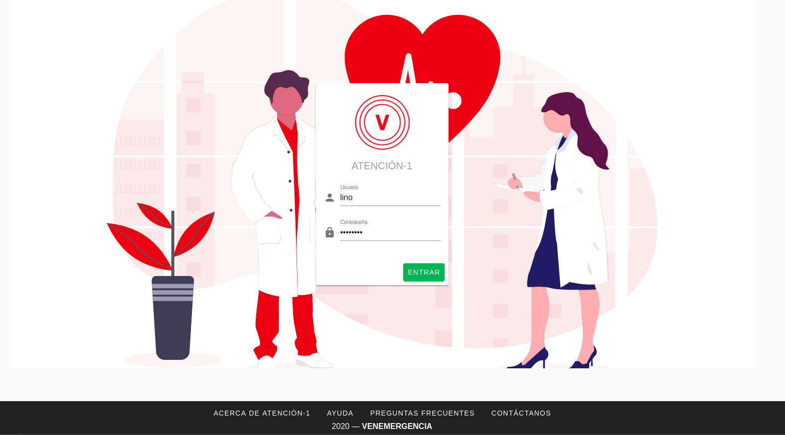

Operador/a
==========

El Operador es la persona que atiende la llamada telefónica y agrega la información del afiliado y su solicitud en la plataforma Atención-1. Recuerda que si quieres conocer los conceptos utilizados en la plataforma Atención-1, puedes revisar este :ref:`glosario` que hemos preparado.

Para ingresar a la plataforma como Operador, debemos escribir en la barra de dirección de nuestro navegador: https://atencion1.venedigital.com. Una vez allí ingresaremos nuestro usuario y contraseña para ingresar a la plataforma. Allí veremos en la barra inferior información acerca de Atención-1, un enlace con ayuda que contendrá un manual,  una guía de Preguntas Frecuentes y enlace a un correo electrónico con el que se podrá contactar al equipo de desarrollo.

Para ingresar debemos indicar el nombre y contraseña del usuario, en este caso Operador. Una vez dentro de la plataforma, vemos varios elementos: en la parte superior del lado derecho tenemos el acceso a los datos del perfil del usuario que acaba de ingresar. Del lado superior izquierdo tenemos el menú donde podemos acceder más fácilmente al panel de atenciones. Y en la parte central, se encuentra el panel de atenciones. Una atención es un conjunto de servicios ofrecidos a titulares o afiliados de pólizas de seguros. Este panel se encuentra dividido en cuatro secciones: 

#. Atenciones en espera.
#. Atenciones próximas programadas: en esta sección se encuentran todos los PHD o MD programados.
#. Atenciones en progreso: esta sección muestra los servicios que actualmente están siendo atendidos.
#. Atenciones por cerrar. 

.. image:: ../images/Operador/OperadorPanelAtencionesGeneral1.png

.. image:: ../images/Operador/OperadorPanelAtencionesGeneral2.png

En la parte superior podemos saber cómo se encuentra o cuál es la condición de cada servicio por medio de un color determinado:

#. El color amarillo indica un servicio abierto.
#. El color verde es un servicio en proceso.
#. El color azul es un servicio completado.
#. El color gris oscuro indica un servicio cerrado.
#. El color gris claro indica un servicio cancelado.
#. El color rojo con que incluye una advertencia con un signo de admiración indica un servicio retrasado.

Al atender una llamada, lo primero que debemos hacer es proceder a crear una **atención**. Para crear una nueva **atención**: 

#. Hacemos click en el círculo de color verde con un signo "+" en su interior.
#. A continuación en el recuadro que contiene el símbolo de la lupa, introducimos la cédula o el nombre de la persona que solicita ser atendida. Atención-1 permite realizar búsquedas con número de cédula o nombre, parcial o completo, de la persona afiliada.
#. Al pulsar Enter o hacer click sobre la lupa, obtendremos los resultados de la búsqueda. En caso de no existir un afiliado/a con esos datos, el sistema permitirá ingresar los datos de una nueva persona afiliada. En caso contrario, deberá seleccionarse de la lista desplegada, cuál es el afiliado o la afiliada a atender.

AGREGAR IMAGEN DE CREACIÓN DE USUARIO

