Médico/a
========

El Médico es la persona que tiene las competencias y licencias para realizar la 
atención médica desde la plataforma de Atención-1. Recuerda que si quieres conocer 
los conceptos utilizados en la plataforma Atención-1, puedes revisar este :ref:`glosario` 
que hemos preparado.

Para ingresar a la plataforma como Médico, debes escribir en la barra de dirección 
del navegador: https://atencion1.venedigital.com. Una vez allí ves en la barra 
inferior información acerca de Atención-1, un enlace con ayuda que contendrá un 
manual, una guía de Preguntas Frecuentes y enlace a un correo electrónico con el 
que se podrá contactar al equipo de desarrollo.

Previamente, el personal encargado de la administración del sistema Atención-1 
es el encargado de crearte el usuario con el rol de Médico para poder ingresar 
al sistema.

Para ingresar debes indicar el nombre y contraseña del usuario. Una vez en la 
plataforma, puedes ver en la parte superior derecha, el acceso a los datos del 
perfil del usuario que acabas de ingresar. Del lado superior izquierdo el menú 
donde puedes acceder más fácilmente al panel de atenciones. En la parte central, 
se muestra el panel de atenciones.

Panel de Atenciones
-------------------

Al ingresar al sistema, la primera pantalla que ves es el Panel de Atenciones, 
distribuida en cuatro secciones:

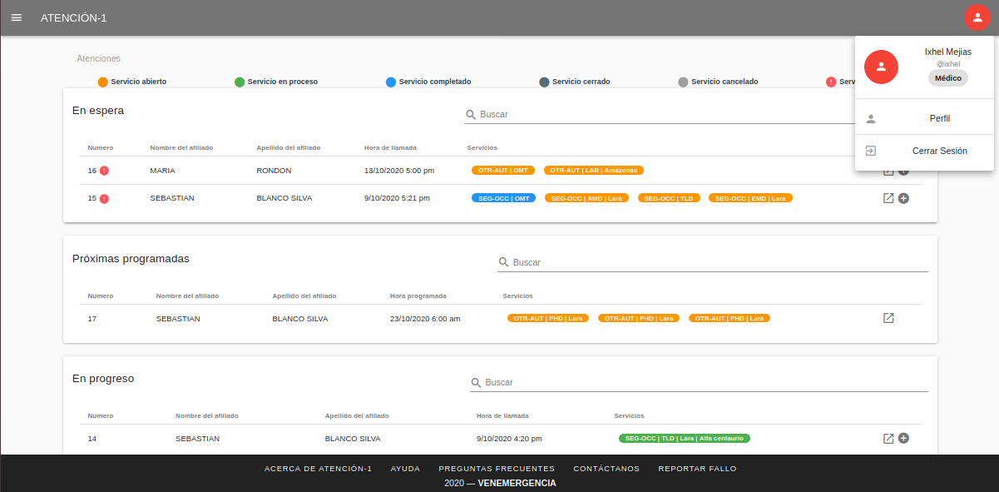

#. Atenciones **En espera**: atenciones abiertas sin servicios o con al menos un servicio abierto o retrasado.
#. Atenciones **Próximas programadas**: atenciones abiertas con al menos un servicio programado dentro de las próximas 24 horas (incluye PHDs y servicios AMD/LAB/TLD/EMD programados).
#. Atenciones **En progreso**: atenciones abiertas con al menos un servicio que actualmente está siendo atendido.
#. Atenciones **Por cerrar**: atenciones abiertas que contienen al menos un servicio completado o cancelado (por cerrar).

Otros elementos que podemos conseguir en el panel de atenciones son los estatus 
de atenciones que se nos indican a través de la leyenda en la parte superior de 
la ventana. Cada color indica un estatus en particular del servicio dentro de 
la atención.

Atender un servicio OMT
-----------------------

Como usuario con rol de Médico, debes atender aquellas atenciones que tengan 
servicio de OMT creado. Por lo que, primeramente, debes acceder a revisar el 
panel de atenciones En espera y ubicar en el listado aquella atención cuya 
columna de Servicios tenga en color amarillo un servicio OMT (el color amarillo 
indica que el servicio tiene status abierto, es decir, no atendido).

Para poder atender la atención con el servicio OMT creado debes hacer clic en 
el extremo derecho de la fila correspondiente y hacer clic en el ícono que muestra 
el mensaje Atender.

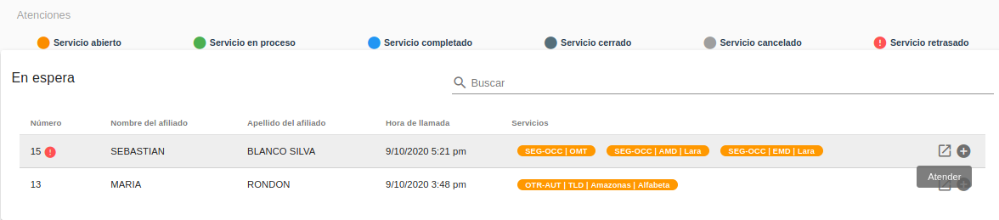

Este paso te conduce a ver la información de la atención seleccionada, donde 
aparecen dos secciones en columnas de páneles: la sección de datos de la atención 
y la sección de los datos de **servicios**.

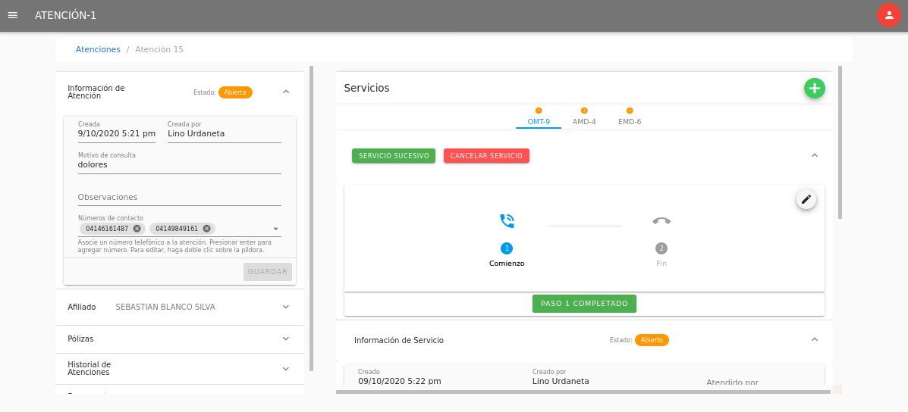

En la columna derecha puedes ver los datos de **servicios**, donde aparecen en 
pestañas los servicios asociados a la atención con los acrónimos de sus nombres, 
que en este caso la pestaña a ubicar es OMT. 
Al momento de tomar la llamada del afiliado, inicias el servicio marcando 
en el botón **Paso 1 Completado**, que registra la fecha y hora del inicio de la llamada. 
Esta acción va a producir el cambio de estado del servicio, pasando de En espera
(amarillo) a En progreso (verde).

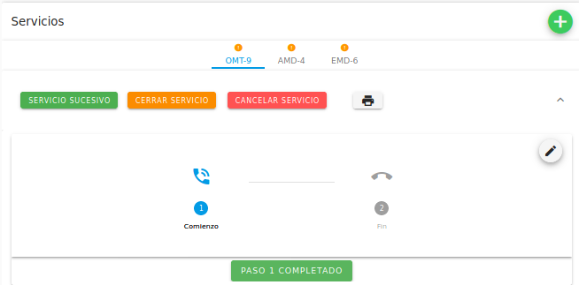

Observa el ícono sobre el acrónimo del servicio en la pestaña del mismo.

.. image:: ../images/Médico/MedicoProgresoOMT.png

Mientras se desarrolla la llamada, según los datos que vayas recibiendo del 
afiliado, tienes disponible los paneles para reunir toda la información que 
necesitas para ejecutar el servicio. En el primer panel, Información de servicio, 
veras tu nombre en el campo **Atendido por**, ya que automáticamente se registra 
quien atiende el servicio. En el campo de **Comentarios** puedes para agregar 
cualquier información u observaciones del servicio.

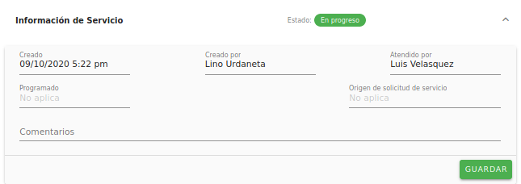

El panel de **Diagnósticos** es el espacio para establecer el cuadro de síntomas 
y el diagnóstico del afiliado durante el servicio. Para ello dispones de 
campos de filtrado automático para **Síntomas** y **Diagnóstico** para que aparezca 
el término mientras lo escribes.  Estos campos contienen registros de síntomas 
y diagnósticos según el estándar internacional de la CIE-10. En caso de que la 
búsqueda del término deseado no coincida con los listados, igualmente puedes 
escribirlo en los campos **Otros síntomas** y **Otros diagnósticos**.

.. image:: ../images/Médico/MedicoDiagnosticoServicio.png

En el último panel de datos del servicio, **Solicitudes**, agregas el récipe e 
indicaciones, ingresas de ser necesario la solicitud de la realización de 
exámenes paraclínicos, alguna observación por tomar en cuenta y recomendaciones. 

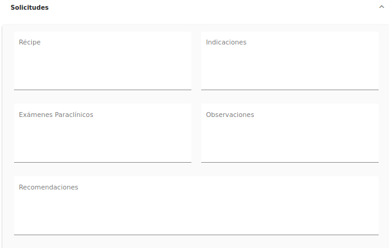

Para los campos donde deben agregarse distintos items, como en **Récipe** e 
**Indicaciones**, te sugerimos que enumeres el medicamento a recetar y su 
indicación correspondiente tenga el mismo número.

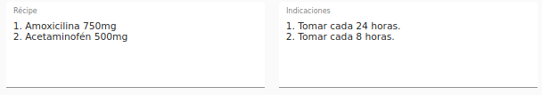

En la columna izquierda aparecen los datos de la atención, estructurada en: 
panel de información general de la atención, panel de datos relevantes del 
afiliado atendido, panel de información general de las pólizas asociadas al 
afiliado, panel del historial de atenciones y el panel de documentos adjuntos 
solicitados para los procesos propios de cada servicio de la atención.
En el primer panel llamado **Información de Atención** tienes la opción de agregar 
alguna observación relevante ocurrida durante la atención, así como también 
cualquier número telefónico de contacto no agregado que sea necesario para la 
ejecución de la atención.

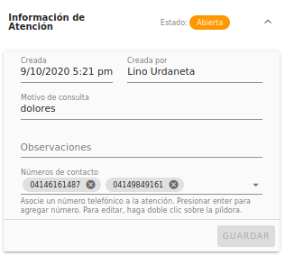

Luego, en el siguiente panel de datos de la atención llamado **Afiliado**, 
también se ofrece la opción de agregar o editar información referente al afiliado: 
nombre, apellido, fecha de nacimiento, sexo, número de teléfonos del afiliado y correo electrónico. 
El campo correo electrónico es necesario agregarlo para que toda la información, 
indicaciones, recomendaciones, entre otros, sean enviadas al afiliado al completar 
el servicio OMT prestado.

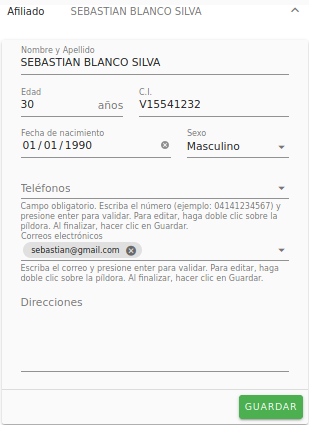

Los paneles de **Pólizas** e **Historial de atenciones** son un recurso informativo, 
mientras que el último panel, **Documentos adjuntos** tiene como finalidad incluir 
los documentos que Venemergencia necesita para procesar la solicitud de ciertos 
servicios, como PHD y EMD. 

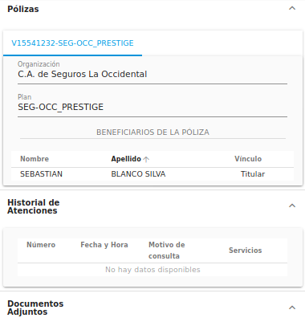

.. image:: ../images/Médico/MedicoPanelInfoDoc.png

Signos de alarma
----------------

Al momento de agregar el diagnóstico o conjunto de diagnósticos del afiliado, 
si el o los términos tienen un asterisco (*), automáticamente se despliega un campo 
de selección llamado **Motivo Principal de Llamada**, donde debes elegir un diagnóstico principal.

.. image:: ../images/Médico/MedicoSignosAlarma.png

Al seleccionar el motivo principal de llamada, se mostrará un listado de preguntas 
de triaje, recomendaciones generales y signos de alarma. 

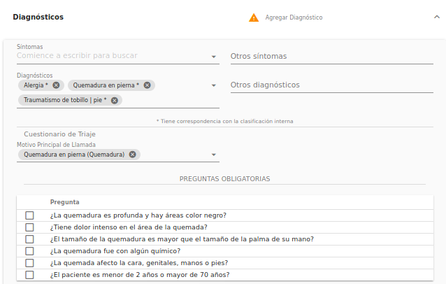

.. image:: ../images/Médico/MedicoRecomendaciones.png

Las preguntas son cerradas (de respuestas sin ambigüedades, si o no) que debes 
realizarle al afiliado. Las respuestas son afirmativas si se hace clic sobre la 
caja de selección que contiene la pregunta. En caso de que alguna de las preguntas 
obligatorias sea afirmativa, se genera el aviso: **Evaluación urgente. AMD o Traslado**. 

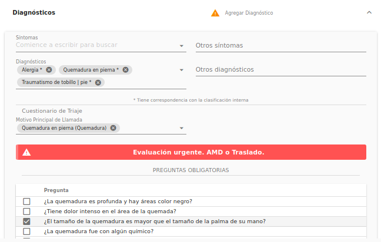

A partir de esta sugerencia, según el grado de complejidad, puedes generar el 
servicio adicional al afiliado que creas conveniente mediante la creación de un 
**Servicio Sucesivo**. 

Crear Servicio Sucesivo
-----------------------
Primeramente, debes hacer clic en el botón **Servicio Sucesivo** de color verde que 
se encuentra justo debajo de la pestaña del servicio donde te encuentras.

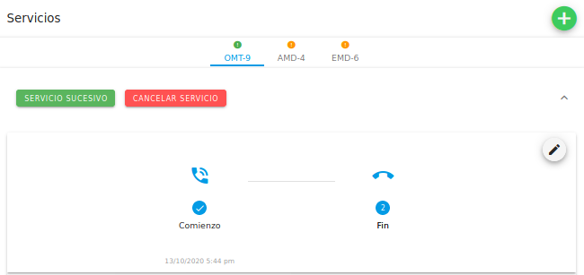

Esta acción despliega un diálogo donde eliges en un campo de selección el tipo 
de servicio a crear, según los servicios que el afiliado tenga disponibles por 
la cobertura de sus planes.

.. image:: ../images/Médico/MedicoSucesivoDesplegado.png

Luego de elegir el servicio, haces clic en el botón **Crear**, que convertirá el 
diálogo en un formulario según el tipo de servicio, cuyos campos tienes la opción 
de llenar o no (según la emergencia), para luego hacer clic en el botón **Crear**.
Una vez realizados los pasos anteriores, se mostrará la pestaña abierta del servicio 
recién creado para ser ejecutado a la brevedad.

Completar Servicio
------------------
Una vez que todos los paneles (**Información de servicio**, **Diagnósticos** y **Solicitudes**) 
contengan la información necesario y que la llamada se haya llevado a cabo, se completa 
el servicio OMT haciendo clic en el botón **Paso 2 Completado** para registrar la hora y fecha 
de culminación de llamada. Al completar este paso, el estatus del servicio cambia a 
Completado (azul).

.. image:: ../images/Médico/MedicoCompletado.png

Atender un servicio EMD o PHD
-----------------------------

Los servicios EMD o PHD que se encuentren en estado Abierto, debes atenderlos para hacer 
revisión de los documentos agregados previamente por el usuario que creó el servicio 
que se encuentran en la sección de Documentos Adjuntos en los paneles de atenciones.

Una vez que hayas hecho la revisión de la información contenida en los documentos, procedes 
a transcribir o aportar los diagnósticos en la sección de Diagnósticos en los paneles del servicio.

Luego puedes agregar los medicamentos a despachar en el panel de Nota de despacho, esta parte es opcional
en el caso de los servicios EMD.

.. _cancelarServicio:

Cancelar Servicio
-----------------

En caso de error de creación de servicio o por cualquier circunstancia que no pueda 
llevarse a cabo el servicio OMT, el servicio puede cancelarse al hacer clic en el 
botón rojo Cancelar Servicio. 

Esta acción despliega un diálogo que muestra un campo de selección múltiple llamado 
Motivo de cancelación, una ves elijas el motivo, haces clic en Confirmar.

.. image:: ../images/Médico/MedicoMotivoCancelacion.png