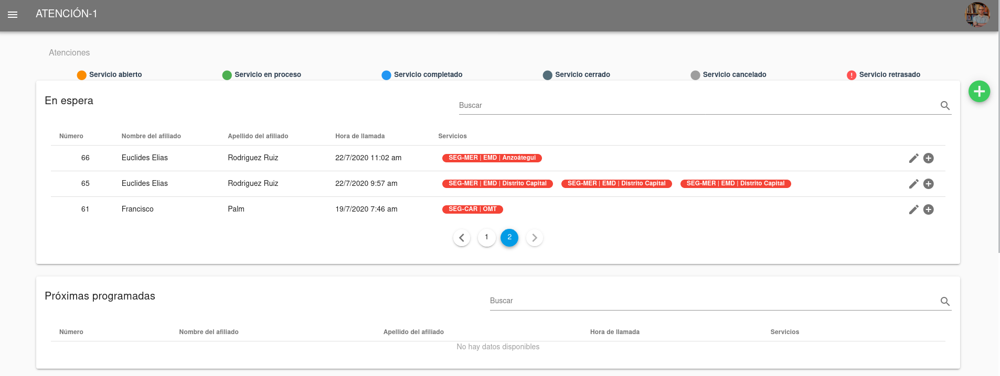

Medico/a
========

El Médico es la persona que tiene las competencias y licencias para realizar la atención médica desde la plataforma de Atención-1. Recuerda que si quieres conocer los conceptos utilizados en la plataforma Atención-1, puedes revisar este :ref:`glosario` que hemos preparado.

Para ingresar a la plataforma como Médico, debes escribir en la barra de dirección del navegador:
https://atencion1.venedigital.com. Una vez allí ves en la barra inferior información acerca de Atención-1, un enlace con ayuda que
contendrá un manual, una guía de Preguntas Frecuentes y enlace a un correo electrónico con el que se podrá contactar al equipo de
desarrollo.

Previamente, el personal encargado de la administración del sistema Atención-1 es el encargado de crearte el usuario con el rol de Médico para poder ingresar al sistema.

Para ingresar debes indicar el nombre y contraseña del usuario. Una vez en la plataforma, puedes ver en la parte superior derecha, el acceso a los datos del perfil del usuario que acabas de ingresar. Del lado superior izquierdo el menú donde puedes acceder más fácilmente al panel de atenciones. En la parte central, se muestra el panel de atenciones.

Panel de Atenciones
-------------------

Al ingresar al sistema, la primera pantalla que ves es el Panel de Atenciones, distribuida en cuatro secciones:

.. image:: ../images/Operador/OperadorPanelAtencionesGeneral2.png

#. Atenciones en espera: en esta sección se encuentran las atenciones recién creadas, si tienen un ícono parpadeante al extremo izquierdo es por que ya tienen un retraso en ser atendidas.
#. Atenciones próximas programadas: en esta sección se encuentran las atenciones con servicios PHD o servicios AMD/LAB/TLD/EMD programados.
#. Atenciones en progreso: esta sección muestra los servicios que actualmente están siendo atendidos.
#. Atenciones por cerrar: sección con atenciones a la espera de ser cerradas ya que algún o todos los servicios fueron completados o cancelados.

Otros elementos que podemos conseguir en el panel de atenciones son los estatus de atenciones que se nos indican a través de la leyenda en la parte superior de la ventana. Cada color indica un estatus en particular del servicio dentro de la atención.

Atender un servicio OMT
-----------------------

Como usuario con rol de Médico, debes atender aquellas atenciones que tengan servicio de OMT creado. Por lo que, primeramente, debes acceder a revisar el panel de atenciones En espera y ubicar en el listado aquella atención cuya columna de Servicios tenga en color amarillo un servicio OMT (el color amarillo indica que el servicio tiene status abierto, es decir, no atendido).

Para poder atender la atención con el servicio OMT creado debes hacer clic en el extremo derecho de la fila correspondiente y hacer clic en el ícono que muestra el mensaje Atender.

.. image:: ../images/Médico/MedicoAtenderAtencionOMT.png

Este paso te conduce a ver la información de la atención seleccionada, donde aparecen dos secciones en columnas de páneles: la sección de datos de la atención y la sección de los datos de servicios.

.. image:: ../images/Médico/MedicoAtencionOMT.png

En la columna derecha puedes ver los datos de servicios, donde aparecen en pestañas los servicios asociados a la atención con los acrónimos de sus nombres, que en este caso la pestaña a ubicar es OMT. 
Al momento de tomar la llamada del afiliado, inicias el servicio marcando en el botón Paso 1 completado, que registra la fecha y hora del inicio de la llamada. Esta acción va a producir el cambio de Estado del servicio, pasando de En espera (amarillo) a En progreso (verde).

.. image:: ../images/Médico/MedicoInicioOMT.png

.. image:: ../images/Médico/MedicoProgresoOMT.png

Mientras se desarrolla la llamada, según los datos que vayas recibiendo del afiliado, tienes disponible los paneles para reunir toda la información que necesitas para ejecutar el servicio. En el primer panel, Información de servicio, veras tu nombre en el campo Atendido por, ya que automáticamente se registra quien atiende el servicio. En el campo de Comentarios puedes para agregar cualquier información u observaciones del servicio.

.. image:: ../images/Médico/MedicoInformacionServicio.png

El panel de Diagnósticos es el espacio para establecer el cuadro de síntomas y el diagnóstico del afiliado durante el servicio. Para ello dispones de campos de filtrado automático para Síntomas y Diagnóstico para que aparezca el término mientras lo escribes.  Estos campos contienen registros de síntomas y diagnósticos según el estándar internacional de la CIE-10. En caso de que la búsqueda del término deseado no coincida con los listados, igualmente puedes escribirlo en los campos Otros síntomas y Otros diagnósticos.

.. image:: ../images/Médico/MedicoDiagnosticoServicio.png

En el último panel de datos del servicio, Solicitudes, agregas el récipe e indicaciones, ingresas de ser necesario la solicitud de la realización de exámenes paraclínicos, alguna observación por tomar en cuenta y recomendaciones. 

.. image:: ../images/Médico/MedicoSolicitudes.png

Para los campos donde deben agregarse distintos items, como en Récipe e Indicaciones, te sugerimos que enumeres el medicamento a recetar y su indicación correspondiente tenga el mismo número.

.. image:: ../images/Médico/MedicoRecipesIndicaciones.png

En la columna izquierda aparecen los datos de la Atención, estructurada en: panel de información general de la atención, panel de datos relevantes del afiliado atendido, panel de información general de las pólizas asociadas al afiliado, panel del historial de atenciones y el panel de documentos adjuntos solicitados para los procesos propios de cada servicio de la atención.
En el primer panel llamado Información de Atención tienes la opción de agregar alguna observación relevante ocurrida durante la atención, así como también cualquier número telefónico de contacto no agregado que sea necesario para la ejecución de la atención.

.. image:: ../images/Médico/MedicoInformaciónAtencion.png

Luego, en el siguiente panel de datos de la atención llamado Afiliado, también se ofrece la opción de agregar o editar información referente al afiliado: fecha de nacimiento, sexo, número de teléfonos del afiliado y correo electrónico. El campo correo electrónico es necesario agregarlo para que toda la información, indicaciones, recomendaciones, entre otros, sean enviadas al afiliado al culminar el servicio OMT prestado.

.. image:: ../images/Médico/MedicoAfiliadoAtencion.png

Los paneles de Pólizas e Historial de atenciones son un recurso informativo, mientras que el último panel, Documentos adjuntos tiene como finalidad incluir los documentos que Venemergencia necesita para procesar la solicitud de ciertos servicios, como PHD y EMD. 

.. image:: ../images/Médico/MedicoPanelInfo.png

Signos de alarma
----------------

Al momento de agregar el diagnóstico o conjunto de diagnósticos del afiliado, si el o los términos tienen un asterisco, automáticamente se despliega un campo de selección llamado Motivo Principal de Llamada, donde debes elegir un diagnóstico principal.

.. image:: ../images/Médico/MedicoSignosAlarma.png

Al seleccionar el motivo principal de llamada, se mostrará un listado de preguntas de triaje, recomendaciones generales y signos de alarma. 

.. image:: ../images/Médico/MedicoPreguntas.png

.. image:: ../images/Médico/MedicoRecomendaciones.png

Las preguntas son cerradas (de respuestas sin ambigüedades, si o no) que debes realizarle al afiliado. Las respuestas son afirmativas si se hace clic sobre la caja de selección que contiene la pregunta. En caso de que alguna de las preguntas obligatorias sea afirmativa, se genera el aviso: Evaluación urgente. AMD o Traslado. 

.. image:: ../images/Médico/MedicoEvaluacionUrgente.png

A partir de esta sugerencia, según el grado de complejidad, puedes generar el servicio adicional al afiliado que creas que sea conveniente mediante la creación de un Servicio Sucesivo.

Crear Servicio Sucesivo
-----------------------

A continuación veremos los pasos a seguir para crear un servicio sucesivo a partir de un OMT.  de estómago con evacuaciones. En la sección de diagnósticos, comenzamos a indagar a través de la persona los síntomas para concluir que su diagnóstico es diarrea. Al ser una diarrea, el síntoma aparecerá con un asterisco y nos va a trasladar a las preguntas de triaje, ya que debemos consultar con la persona algunos aspectos del síntoma por medio de preguntas obligatorias y preguntas opcionales para validar si requiere una atención domiciliaria, por ejemplo. Supongamos que al realizarle las preguntas a esta persona, descubrimos que ha tenido más de diez evacuaciones en las últimas 24 horas y ha utilizado medicamento para la diarrea sin tener algún efecto. En este caso, como lo hemos marcado a través de las preguntas de triaje, el sistema mostrará que la persona requiere una atención domiciliaria. Entonces, le haremos saber al paciente que es necesario que reciba una atención domiciliaria y completamos el paso 2. A continuación nosotros podemos generar un servicio sucesivo. 
El primer paso para crear este servicio es pulsar el botón de servicio sucesivo y podemos seleccionar, como parte del mismo ejemplo, que vamos a solicitar un servicio AMD-Retail. Como el contacto telefónico continúa, debemos preguntarle a la persona su dirección a ver si se encuentra en el mismo domicilio que tiene el sistema. En algunos casos los pacientes se encuentran en domicilio de familiares o en otro domicilio, por lo que siempre debemos verificar la dirección al prestar este tipo de servicio. Una vez asignada la dirección procedemos a crear el servicio pero, como en este caso se trata de una diarrea, incluimos pruebas de laboratorio y así quienes presten el servicio sabrán que deben contar con kit para realizar dichas pruebas. Con todos estos pasos hemos logrado completar exitosamente este servicio.   

Completar Servicio
------------------

Completar el flujo de trabajo para marcar el cierre de la llamada.

Cancelar Servicio
-----------------

A continuación vamos a cancelar un servicio que un operador ha creado por error o por cualquier otro motivo por el que amerite ser cancelado. Supongamos que deseamos cancelar un servicio OMT, por lo que hacemos clic en el botón de atender. Cuando se nos despliega la información marcamos el paso 1 como completado si la persona ya no está al teléfono o perdimos el contacto. Después hacemos clic en cancelar servicio  e indicamos el motivo por el que estamos cancelando dicho servicio. Como el médico perdió contacto con la persona o se perdió la llamada, podemos usar la opción cancelado por el paciente y confirmamos la opción. Al hacerlo, notaremos que en la pantalla ya se muestra que el servicio ha sido cancelado. De todas formas, podemos confirmar que en Atenciones este servicio en particular, esa atención, ya no se encuentra en espera sino que se encuentra en las atenciones por cerrar que quedará pendiente para que el coordinador la cierre.  