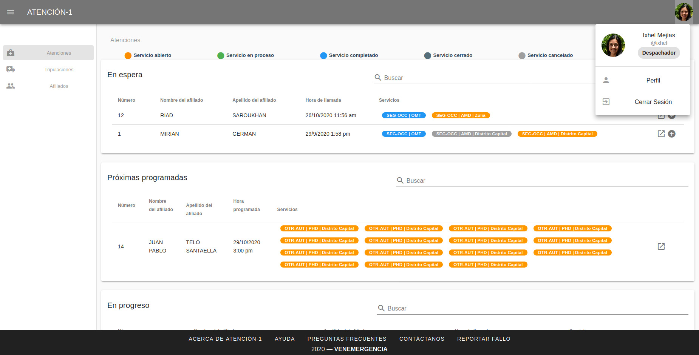

Despachador/a
=============

El Despachador es la persona responsable de la puesta en marcha, seguimiento y
gestión, en general, de servicios de atención que contemplan el traslado de
medicamentos, personal y/o equipos.

Como Despachador, tienes permisos de acceso a labores de gestión de tripulaciones,
operaciones con traslados de afiliados, entregas de medicamentos y otros servicios
ofrecidos por Atención-1 que involucren el traslado de medicamentos, personal y/o
equipos. Estos servicios son de tipo: AMD, TLD, EMD, PHD y LAB. Recuerda que si
quieres conocer los conceptos utilizados en la plataforma Atención-1, puedes
revisar este :ref:`glosario` que hemos preparado.

Para poder ingresar a Atención-1 como Despachador, el personal encargado de la
administración del sistema debe, previamente, crear el usuario y asignarle el
rol de Despachador.

Para acceder a la plataforma, debes escribir en la barra de dirección del
navegador: https://atencion1.venedigital.com. Una vez allí podrás visualizar en
la barra inferior un conjunto de enlaces, a través de los cuales podrás obtener
información acerca de Atención-1, tener acceso a un manual de ayuda y a una
guía de **Preguntas Frecuentes**, contactar al equipo de desarrollo vía correo
electrónico y reportar fallos/sugerencias.

Para ingresar debes indicar el nombre de usuario y contraseña. Una vez dentro
de la plataforma, como usuario Despachador, desde la parte superior derecha
puedes tener acceso a los datos del perfil de usuario y cerrar la sesión. En
la esquina superior izquierda se despliega el menú de "hamburguesa", desde el
cual puedes navegar fácilmente a los paneles de **Atenciones**, **Tripulaciones** y **Afiliados**.
En la parte central se encuentra el panel de atenciones, dividido en cuatro secciones:

#. Atenciones **En espera**: atenciones abiertas sin servicios o con al menos un servicio abierto o retrasado.
#. Atenciones **Próximas programadas**: atenciones abiertas con al menos un servicio programado dentro de las próximas 24 horas (incluye PHDs y servicios AMD/LAB/TLD/EMD programados).
#. Atenciones **En progreso**: atenciones abiertas con al menos un servicio que actualmente está siendo atendido.
#. Atenciones **Por cerrar**: atenciones abiertas que contienen al menos un servicio completado o cancelado (por cerrar).

En la parte superior puedes observar una leyenda de colores que indica el estatus del servicio:

#. El color amarillo indica un servicio abierto.
#. El color verde es un servicio en proceso.
#. El color azul es un servicio completado.
#. El color gris oscuro indica un servicio cerrado.
#. El color gris claro indica un servicio cancelado.
#. El color rojo indica un servicio retrasado.

Cuando una atención **En espera** contiene al menos un servicio en retraso,
presenta una alerta intermitente de color rojo con un signo de admiración,
ubicada en la parte izquierda de la fila (al lado del número de la atención).

Si la cantidad de atenciones en cada panel es mayor a 10, debes navegar a
través de los botones de paginación en la parte inferior del panel, para
revisar si existe algún servicio pendiente por atender o ubicar alguna atención
específica que no se encuentre en el primer listado.

Para crear un nuevo servicio asociado a una atención, haces clic sobre el
botón de **Crear Nuevo Servicio**, ubicado en la parte derecha de la fila
correspondiente.

Para visualizar los detalles de una atención en particular, haces clic sobre el
botón de **Abrir**, ubicado en la parte derecha de la fila
correspondiente. Al posicionar el cursor sobre el ícono aparecerá el mensaje
**Atender** o **Revisar**, según la sección en que se encuentre. Serás
redireccionado a la página de detalles de la atención seleccionada.

.. image:: ../images/Despachador/DetallesAtención.jpg

En esta página podrás visualizar dos secciones. La sección lateral izquierda contiene cinco paneles con los datos importantes de la atención: el panel de información general
de la atención, el panel de datos relevantes del afiliado atendido, el panel de
información general de las pólizas asociadas al afiliado, el panel del historial
de atenciones del afiliado y el panel de documentos adjuntos solicitados para
los procesos propios de cada servicio de la atención. La sección lateral
derecha presenta la información referente a los servicios contenidos en la
atención. Los servicios se muestran, con los acrónimos de sus nombres, en
pestañas. Al hacer clic sobre cada pestaña se despliega la información del
servicio, distribuida en paneles. Esta información varía según el tipo de
servicio.

Todos los paneles (de atenciones y servicios) se expanden y se reducen al hacer
clic sobre la cabecera del mismo (donde se encuentra el título).

Gestionar Atenciones y Servicios
--------------------------------

En lo referente a la gestión de atenciones y servicios, como usuario
Despachador tienes permisos para crear nuevos servicios, visualizar todos
los detalles de una atención y de un servicio e imprimir el ticket del
servicio, las solicitudes (récipes y recomendaciones) y las notas de despacho.
En cuanto a los permisos de actualización, como Despachador puedes:

* Editar las observaciones y los números de contacto asociados a una atención,
  editar datos de un afiliado (nombre, apellido, fecha de nacimiento, género,
  teléfonos y correos electrónicos) y adjuntar archivos (resultados de laboratorio,
  indicaciones, récipes e informes médicos), en los paneles **Información de Atención**,
  **Afiliado** y **Documentos Adjuntos**, respectivamente, de la sección lateral
  izquierda correspondiente a detalles de una atención.
* Editar los comentarios y el motivo de servicio, en el panel **Información de
  Servicio**.
* Editar la tripulación y ruta en el panel **Tripulación y Ruta**.
* Editar los síntomas y diagnósticos en el panel **Diagnósticos**.
* Editar la información referente a las solicitudes en el panel **Solicitudes**.
* Adjuntar resultados de laboratorio, en el panel **Resultados**.
* Cancelar servicios, en el panel del flujo de trabajo.
* Completar cada paso del flujo de trabajo de un servicio y editar sus fechas y horas, en el panel del flujo de trabajo.

.. note::
    Es importante destacar que como Despachador, podrás actualizar y atender los servicios de tipo AMD, TLD, EMD, PHD y LAB.
    Para un servicio OMT, solamente tienes acceso a la edición de los comentarios, en el panel **Información de Servicio**.

Desarrollar:
El Despachador puede crear nuevas atenciones...

Atender servicio AMD
********************

Al iniciar la atención de un servicio AMD, lo primero que debes hacer es
asignar la tripulación y, en caso de que no haya sido asignada previamente,
la dirección de destino. Para ello, te ubicas en el panel **Tripulación y Ruta**.

.. image:: ../images/Despachador/PanelTripulaciónYRuta.jpg

En el campo **Tripulación** aparecerá un listado de las tripulaciones activas para
el día. Al seleccionar una de ellas, los demás campos automáticamente se llenarán
y podrás visualizar información relevante acerca de la tripulación: nombre, base,
unidad y conductor. Si en el campo **Tripulación** no se despliega un listado y aparece
el mensaje "No hay datos disponibles", debes dirigirte al panel de **Tripulaciones**
(a través del menú de "hamburguesa" en la parte superior izquierda) para crear al menos una tripulación que estará
activa para el día en curso. Para más detalles acerca de la creación de una tripulación, puedes revisar la sección :ref:`gestionar_tripulaciones`.

Como Despachador, podrás asignar una nueva dirección de destino o editar la que
fue asignada previamente. Al hacer clic sobre el campo **Destino**, aparecerá una ventana de diálogo para este fin. 

.. image:: ../images/Despachador/AsignarDirección.jpg

Si haces clic en el campo **Dirección**, se presentará un listado desde el cual podrás
seleccionar una dirección personal del afiliado, de un servicio ejecutado previamente
o de un proveedor de salud. Si no encuentras la dirección deseada en este listado,
también tendrás la opción de asignar una nueva dirección completando los campos
presentados en la parte inferior de la ventana (Dirección Línea 1, Estado, Municipio
y Parroquia). Para asignar una dirección, haz clic en el botón **Asignar**.

Recuerda que una vez asignada la tripulación y el destino, debes hacer clic en el botón
**Guardar** en la esquina inferior derecha del panel, para que la información se guarde
efectivamente. Podrás notar que desaparecerá la advertencia **Asignar Tripulación y Ruta** (en la cabecera) e indicará la unidad asignada.

.. image:: ../images/Despachador/TripulaciónYRutaAsignadas.jpg

Posteriormente puedes dar inicio al flujo de trabajo del servicio AMD,
haciendo clic en el botón **Paso 1 Completado** una vez ejecutado el despacho.

Al hacer clic en este botón, la fecha y hora de despacho será establecida automáticamente. Podrás visualizar que el servicio cambiará su estatus a "En progreso" y que serás asignado como encargado de atender el servicio (ver el campo **Atendido por**).

.. image:: ../images/Despachador/AMDPanelFlujoDeTrabajoPaso1Completado.jpg

Al recibir los reportes de completación de cada paso del flujo de trabajo,
debes ir registrando cada paso como completado haciendo clic en el botón
correspondiente. Las fechas y horas se asignarán automáticamente.

También tienes la opción de editar las fechas y horas asignadas. Al hacer clic
en el botón de "edición" (con ícono de "lápiz"), en la esquina superior derecha
del panel de flujo de trabajo, se presentará una ventana de diálogo donde tendrás
la posibilidad de asignar nuevas fechas y horas y de editar aquellas asignadas previamente.

En el panel **Información de Servicio**, podrás visualizar los detalles generales
del servicio. En caso de que incluya la realización de exámenes de laboratorio,
se presentará en la cabecera del panel (donde se encuentra el título) un ícono azul
de **matraz de Erlenmeyer**. Al posicionar el cursor sobre el ícono aparecerá el mensaje "Incluye exámenes de laboratorio". Podrás consultar el conjunto de exámenes en
el campo **Exámenes de laboratorio** y editar los comentarios y el motivo de servicio.

.. image:: ../images/Despachador/AMDInformaciónDeServicio.jpg

Es responsabilidad del Despachador completar la información de los paneles
**Diagnósticos**, **Solicitudes** y **Resultados** (en caso de que el servicio incluya
exámenes de laboratorio).

En el panel **Diagnósticos** podrás añadir información acerca de los síntomas y
diagnósticos detectados en la ejecución del servicio.

.. image:: ../images/Despachador/AMDDiagnósticos.jpg

Debes seleccionar al menos un item en el campo **Diagnóstico**. Si el
diagnóstico no se encuentra en el listado que se despliega, puedes escribirlo
en el campo **Otros diagnósticos**. Al terminar, haz clic en **Guardar**.

En el panel **Solicitudes** podrás agregar información referente al récipe, indicaciones, exámenes paraclínicos, observaciones y recomendaciones. Al terminar, haz clic en "Guardar".

En el panel **Resultados** podrás adjuntar documentos correspondientes a
resultados de laboratorio asociados al servicio.

.. image:: ../images/Despachador/AMDResultados.jpg

Para adjuntar un resultado de laboratorio, haz clic en el botón de **sujetapapeles**.
Se presentará una ventana de diálogo donde podrás adjuntar un documento y agregar
una descripción (opcional). Al terminar, haz clic en **Adjuntar**.

.. warning::
    Recuerda que como Despachador debes registrar al menos un diagnóstico y,
    en caso de que el servicio AMD incluya exámenes de laboratorio, adjuntar los
    resultados de los mismos, para que posteriormente el Coordinador pueda cerrar
    el servicio completado.

.. note::
    Los servicios AMD con estatus Cancelado, Abierto o Retrasado no requieren
    Diagnóstico ni Resultados.

Atender servicio TLD
********************

Atender servicio EMD
********************

Atender servicio PHD
********************

Atender servicio LAB
********************

Crear servicio
**************

Como Despachador podrás crear servicios de tipo OMT, AMD, TLD, EMD y LAB.

Cancelar servicio
*****************

La cancelación de un servicio puede ser ejecutada por cualquier
usuario (a excepción del rol Asistente) y puede ocurrir en cualquier momento
del desarrollo del mismo, por diversos motivos, por ejemplo: si el lugar en que
se iba a prestar el servicio corresponde a una zona de difícil acceso y el
afiliado no desea acordar otro punto de encuentro, si no se logra establecer
contacto con el afiliado, etc.

El botón de **Cancelar Servicio** está ubicado en la cabecera del panel del flujo
de trabajo. Si el servicio fue previamente cancelado o completado, el botón estará
deshabilitado. Si el botón está habilitado aparecerá en color rojo. Al hacer clic
sobre él, podrás visualizar una ventana de diálogo donde debes seleccionar el
motivo de cancelación. Una vez seleccionado el motivo, haz clic en **Confirmar**
y el servicio será cancelado inmediatamente.

.. _gestionar_tripulaciones:

Gestionar Tripulaciones
-----------------------

Si haces clic en el item **Tripulaciones** del menú lateral izquierdo, podrás
visualizar el listado de tripulaciones activas (del día). Dispones de un campo
de búsquedas en la parte superior derecha del listado para localizar una
tripulación en específico.

.. image:: ../images/Despachador/ListadoTripulaciones.jpg

Al hacer clic sobre una fila del listado, se despliega una ventana de diálogo
con todos los detalles de la tripulación seleccionada. 

.. image:: ../images/Despachador/DetallesTripulación.jpg

Podrás imprimir esta información haciendo clic en el ícono de **impresora**,
ubicado en la esquina inferior izquierda de la ventana de diálogo.

Si deseas editar una tripulación en particular, haz clic sobre el botón de
**lápiz**, en la fila correspondiente. Al terminar la edición, haz clic en **Guardar**.

.. image:: ../images/Despachador/EditarTripulación.jpg

Para crear una nueva tripulación, haz clic en el botón verde circular con signo "+".
Al posicionar el cursor sobre el botón aparecerá el mensaje "Crear Tripulaciones".
Al hacer clic sobre el botón, aparecerá una ventana de diálogo con un formulario
que debes completar. Te sugerimos que el nombre que le establezcas a la tripulación
sea pertinente, de manera que te oriente al momento de seleccionar la tripulación a
asignar a un servicio (por ejemplo: podría incluir el tipo de vehículo). Al
terminar, haz clic en **Crear**.

.. image:: ../images/Despachador/CrearTripulación.jpg

Si deseas borrar una tripulación en particular, haz clic sobre el botón de
**papelera**, en la fila correspondiente. Te aparecerá un aviso, para confirmar
la eliminación de la tripulación, haz clic en **Borrar**.

.. image:: ../images/Despachador/AvisoBorrarTripulación.jpg

Despachador. Crear tripulación.
------------------------------
Una de las tareas que debe hacer el Despachador es la Creación de las tripulaciones. Las tripulaciones se crean a través del Menú que se encuentra en la esquina superior izquierda y que nos permite acceder también al Panel de Atenciones. Al hacer clic en el menú de Tripulaciones se observa si ya hay tripulaciones creadas. En el caso que no hayan tripulaciones creadas o que se quiera añadir alguna, se debe hacer clic en el botón verde con el signo más (+) y proceder a ingresar todos los datos solicitados.
El Nombre de la Tripulación se sugiere que sea un nombre que pueda servir al momento de asignar la tripulación de manera orientativa y que incluya, por ejemplo, el tipo de vehículo que se trate. Sin embargo esto no es limitativo, cualquier nombre se le puede colocar. Vamos a colocarle, por ejemplo, Alfa1 luego indicando la fecha: Alfa1_31_08.
Luego colocamos la fecha y hora en la cual comienza esa guardia, la fecha en el formato de: día, mes y año. El formato de la hora en formato militar, es decir, a partir de las 12 del mediodía se coloca 13 y así sucesivamente hasta el 24. Igualmente se coloca la fecha y hora final o de cierre de esta tripulación.
En lo referente a la Base le indicamos en dónde está ubicada esa tripulación. Luego le asignamos una unidad y le asignamos también el personal que está asociado a esa tripulación y pulsamos en **Cerrar** para validar que, efectivamente, se creó la tripulación.
Una vez que se ha creado se observa desplegada en la lista de tripulaciones disponibles para ese día. Con esto hemos creado una tripulación

Despachador. Atender AMD.
------------------------
Vamos ahora con el procedimiento de atención como Despachador de un servicio AMD.
Seleccionamos el servicio y hacemos clic en el botón de **Atender** y allí se nos despliega el detalle tanto de la atención como del servicio. Se tienen dos (02) secciones:
*En la sección del lado izquierdo: tenemos todo el detalle de la atención, la hora y fecha de la creación, quién lo tomó, el teléfono que se registró al momento de crear la atención. Tenemos datos sobre el afiliado, la póliza, el historial de atenciones (en caso de que lo haya) y se nos permite agregar Documentos adjuntos en el caso que sea necesario.
*En la sección del lado derecho se encuentran los datos del servicio seleccionado para atender, incluyendo el estatus, si se desea crear un Servicio sucesivo, a través del botón Servicio sucesivo o Cerrar el servicio a través del botón Cancelar servicio. Se nos indica también en esta sección, quién creó el servicio y algún detalle adicional así como la tripulación y el diagnóstico.
Como ejemplo, seleccionamos un servicio **En espera** para atender un servicio de AMD. Lo primero que debemos hacer es asignar tripulación. Entonces nos desplazamos en la sección del lado derecho hasta la sección de **Tripulación** donde se nos indica cuál es la dirección y procedemos a asignar la tripulación. En el menú desplegable van a aparecer todas las tripulaciones disponibles en función de las que hayamos creado al inicio del día. Al seleccionarla se carga toda la información relativa tanto a las personas (médicos y paramédicos que están en la unidad) como a la unidad, la base, etc. Hacemos clic en el botón **Guardar** y ya no aparece el indicativo (alerta) de asignar tripulación.
En el caso de faltar el **Diagnóstico** es importante notificar al Coordinador o al Médico que tomó esta solicitud para que ingrese el diagnóstico. En todo caso, luego de asignar la tripulación podemos marcar el **Paso 1 completado**. Antes de asignar la tripulación no podíamos completar el paso 1 que es el inicio del despacho del servicio. Según se van completando los distintos pasos de este servicio de atención médica, vamos señalando los pasos completados donde se registra en cada uno la hora en la que se tildó como completado. Se indica la Llegada al Destino, Salida del Destino y la Llegada a Base o paso 5 completado y en este momento ya se da por completada la atención del servicio AMD.

Despachador. Atender TLD, EMD o LAB.
-----------------------------------
Vamos a atender ahora como Despachador, un servicio TLD. El procedimiento a seguir para la atención del servicio de Traslado es básicamente el mismo que se sigue para la atención de servicios como EMD, TLD y AMD. 
Entramos en la pestaña del servicio haciendo clic en el botón de **Atender** en la lista de atenciones y una vez dentro del servicio en la sección donde está el detalle del servicio (sección del lado derecho) se asigna la tripulación que es básicamente lo que se requiere para que se habilite el ir completando los pasos. Ya que el botón de **Paso 1 completado** se encuentra sombreado cuando el servicio no cuenta con una tripulación, lo primero que se debe hacer es Asignar la tripulación. Se asigna la tripulación, se verifica el nombre de las personas que integran esa tripulación, se hace clic en el botón **Guardar**. Se verifica que se ha actualizado la información ya que desaparece la señal de alerta que se debe agregar la tripulación y porque, además, ya el botón de **Paso 1 completado** está habilitado. Pulsamos el **Paso 1 completado** y según vamos teniendo información por comunicación directa con la tripulación de que los siguientes pasos se van completando, vamos pulsando en los ítems correspondientes. Por ejemplo, en el caso de un traslado solo de ida, es decir, es un traslado que sale de la base, llega a la casa de la persona, y la traslada a otro lugar (por ejemplo, un Centro Hospitalario) y de allí retorna a la base. Una vez que vamos marcando en cada paso completado, se registra la fecha y hora en la que se culminó cada una de las etapas de ese traslado. Una vez que pulsamos en la etapa número 7 que, en este caso, es la llegada de nuevo a la base vemos que el servicio pasa de estado **En proceso** a **Estado Completado**, es decir, que ya ese servicio ha terminado.
Básicamente es el mismo procedimiento el que vamos a seguir como Despachador para atender todo servicio que involucra la asignación de una tripulación y su desplazamiento hasta el lugar en el que se encuentra el afiliado o hasta el lugar donde se le va a prestar la atención médica, si es de trasladar a un equipo médico.
Con esto ya hemos atendido un TLD.

Despachador. Atender PHD.
------------------------
Como Despachador vamos a hacer ahora la atención de un PHD. Como el PHD es una atención programada se despliega en la sección del Panel de atención que indica **Próximas programadas**. Es importante señalar que allí se ubican las atenciones que se encuentran en un margen próximo de hasta dos horas; esto es así para que el Despachador pueda con ello facilitar la organización de las rutas de las distintas tripulaciones en la atención.
Como ejemplo, se tiene una atención próxima programada para las 06:00 pm que involucra evidentemente un servicio PHD que es el servicio programado. Sin embargo, en esta sección pudiera aparecer también cualquier otro servicio de los que estén programado. Hacemos clic en el botón de **Atender** y pasamos a la pestaña de detalles de los servicios. Allí observamos que se ha generado automáticamente una pestaña de servicio para cada uno de los servicios involucrados aún cuando sean fechas posteriores.
Como un servicio de traslado que involucra una tripulación, lo primero que debemos hacer es asignar precisamente la tripulación y es lo que nos indica la señal de advertencia que dice **Asignar Tripulación** y es la razón por la cual el botón de **Paso 1 Completado** no está habilitado. Asignamos la tripulación del modo en que se asigna normalmente, verificamos el nombre de los componentes de esa tripulación, pulsamos en **Guardar** y verificamos que se han guardado bien los datos de tripulación. Además ya no aparece la señal de advertencia de Asignar Tripulación y aparece habilitado el **Paso 1 Completado**. De esta forma vamos señalando al igual que en los otros servicios, cada uno de los pasos según se van completando y se verifica en la parte inferior del paso, la fecha y hora en la que fue completado.
Cuando se concluyen todos los pasos relativos, en este caso, al PHD el estado del servicio pasa de **En Progreso** a **Completado**. Si regresamos al historial de atenciones observamos que ya no está ese servicio marcado con amarillo que es *Por atender*, sino en color azul que significa que ya está completado.
Con esto hemos atendido un servicio PHD.

Despachador. Imprimir ticket.
----------------------------
Vamos a ver ahora cómo se hace la impresión de un ticket en el que se incluyen todos los detalles de un servicio. En todo momento vemos que dentro de la pestaña del servicio tenemos habilitado un ícono con la imágen de una impresora que sirve precisamente para imprimir los detalles del servicio.
Recordemos que en la impresión del ticket del servicio se imprime toda la información que se ha cargado en ese servicio. Es decir, si tenemos una tripulación asignada se informa y si tenemos un Diagnóstico también se informa. Sin embargo, si algunos de esos campos falta pues no aparecen al momento de la impresión del ticket, con lo cual es importante imprimir el ticket solamente en el momento en el que toda la información relativa a cada uno de los servicios involucrados, en este caso al servicio que se quiere imprimir, esté completamente indicada. 
Al seleccionar cualquiera de los servicios disponibles y hacer clic en **Imprimir ticket** del servicio se despliega la información disponible que será la que se refleja en el ticket impreso. Hacemos clic en el botón **Imprimir** y se genera un archivo en PDF que se pide a través de la instancia y se debe seleccionar la ubicación dentro de la computadora para ser almacenado.
Esa información se almacena en la carpeta que seleccione la persona y ya se ha generado el ticket respectivo en formato PDF.

Despachador. Crear servicio sucesivo programado.
------------------------------------------------
Vamos a crear como Despachador un servicio sucesivo, el cual se puede crear en cualquier fase de un servicio. No necesariamente supone la cancelación del servicio que lo origina sino que de alguna manera se toma la información a partir de allí.
Por ejemplo, en el caso de tener un servicio AMD podemos generar un servicio sucesivo haciendo clic en el botón **Servicio sucesivo**, allí se indica el tipo de servicio sucesivo que vamos a solicitar, en este caso, pudiera ser un servicio EMD. Luego indicamos el motivo y el destino. El servicio contiene información acerca de qué viene derivado de un servicio AMD y se puede indicar que es un servicio programado, esto es, que no es atendido en ese momento sino que va a ser en una fecha posterior. Allí se indica la fecha y la hora en la que se va a prestar el servicio, pulsamos en el botón **Crear** y observamos que se despliega como una EMD en otra pestaña dentro de la misma atención de este afiliado.

Despachador. Cancelar servicio.
-------------------------------
Veamos ahora la funcionalidad de Cancelar un servicio desde el usuario Despachador.
En cualquiera de las pestañas de los servicios, siempre que el servicio no haya sido Completado o Cancelado, puede cancelarse el mismo. Esto lo vemos cuando está activado el botón de **Cancelar Servicio** en color rojo.
Seleccionamos el servicio que queremos cancelar y hacemos clic en el botón **Cancelar Servicio** y se despliega una ventana en la que debemos indicar *el Motivo de Cancelación*, el cual va a depender de las circunstancias, luego pulsamos en **Confirmar** y el servicio ha sido cancelado exitosamente.