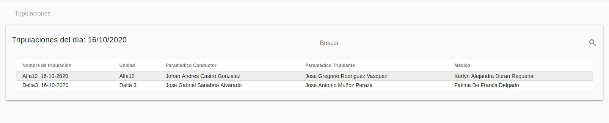
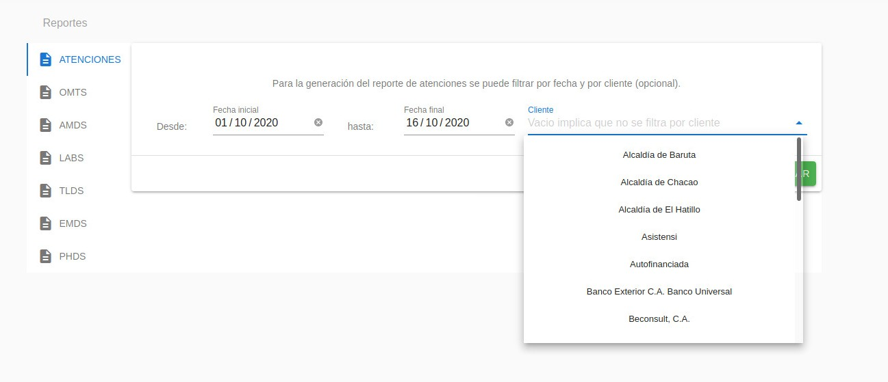
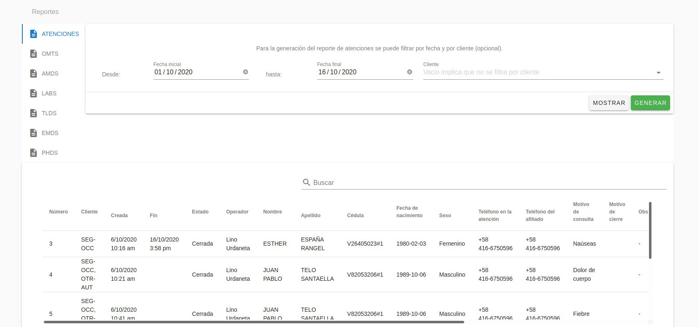
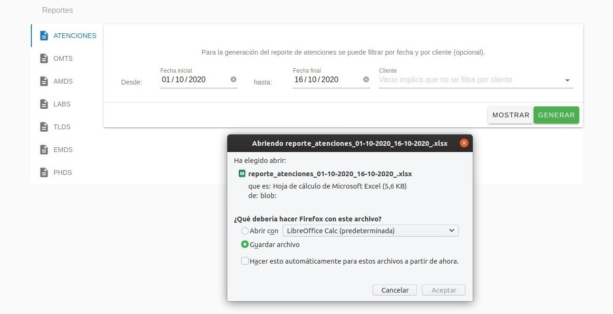
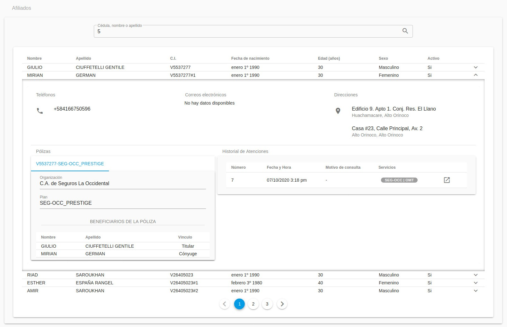

Coordinador/a
=============

El Coordinador es la persona responsable de la verificación del cumplimiento de
las actividades operativas en la prestación de los servicios. Tiene permisos de
acceso a tareas de gestión de servicios y atenciones dentro de la plataforma
Atención-1. Recuerda que si quieres conocer los conceptos utilizados en la
plataforma Atención-1, puedes revisar este :ref:`glosario` que hemos preparado.

Para poder ingresar a Atención-1 como Coordinador, el personal encargado de la
administración del sistema debe, previamente, crear el usuario y asignarle el
rol de Coordinador.

Para acceder a la plataforma, debes escribir en la barra de dirección del
navegador: https://atencion1.venedigital.com. Una vez allí podrás visualizar en
la barra inferior un conjunto de enlaces, a través de los cuales podrás obtener
información acerca de Atención-1, tener acceso a un manual de ayuda,
guía de Preguntas Frecuentes y video tutoriales, contactar al equipo de desarrollo vía correo
electrónico y reportar fallos/sugerencias.

Para ingresar debes indicar el nombre de usuario y contraseña. Una vez dentro
de la plataforma, como usuario Coordinador, desde la parte superior derecha
puedes tener acceso a los datos del perfil de usuario y cerrar la sesión. En
la esquina superior izquierda se despliega el menú de "hamburguesa", desde el
cual puedes navegar fácilmente a los paneles de **Atenciones**, **Tripulaciones**,
**Reportes** y **Afiliados**. En la parte central se encuentra el panel de atenciones,
dividido en cuatro secciones:

#. Atenciones **En espera**: atenciones abiertas sin servicios o con al menos un servicio abierto o retrasado.
#. Atenciones **Próximas programadas**: atenciones abiertas con al menos un servicio programado dentro de las próximas 24 horas (incluye PHDs y servicios AMD/LAB/TLD/EMD programados).
#. Atenciones **En progreso**: atenciones abiertas con al menos un servicio que actualmente está siendo atendido.
#. Atenciones **Por cerrar**: atenciones abiertas que contienen al menos un servicio completado o cancelado (por cerrar).

Para crear un nuevo servicio asociado a una atención, haces clic sobre el
botón de "Crear Nuevo Servicio", ubicado en la parte derecha de la fila
correspondiente.

Para visualizar los detalles de una atención en particular, haces clic sobre el
botón de "Abrir", ubicado en la parte derecha de la fila
correspondiente. Al posicionar el cursor sobre el ícono aparecerá el mensaje
"Revisar" o "Cerrar", según la sección en que se encuentre. Serás
redireccionado a la página de detalles de la atención seleccionada.

.. image:: ../images/Coordinador/DetallesAtención.jpg

En esta página podrás visualizar dos secciones. La sección lateral izquierda contiene cinco
paneles con los datos importantes de la atención: el panel de información general
de la atención, el panel de datos relevantes del afiliado atendido, el panel de
información general de las pólizas asociadas al afiliado, el panel del historial
de atenciones del afiliado y el panel de documentos adjuntos solicitados para
los procesos propios de cada servicio de la atención. La sección lateral
derecha presenta la información referente a los servicios contenidos en la
atención. Los servicios se muestran, con los acrónimos de sus nombres, en
pestañas. Al hacer clic sobre cada pestaña se despliega la información del
servicio, distribuida en paneles. Esta información varía según el tipo de
servicio.

Todos los paneles (de atenciones y servicios) se expanden y se reducen al hacer
clic sobre la cabecera del mismo (donde se encuentra el título).

Gestionar Atenciones y Servicios
--------------------------------

En lo referente a la gestión de atenciones y servicios, como usuario
Coordinador tienes permisos para crear nuevas atenciones, crear nuevos
servicios, visualizar todos los detalles de una atención y de un servicio e
imprimir el ticket del servicio, las solicitudes (récipes y recomendaciones) y
las notas de despacho. En cuanto a los permisos de actualización, como Coordinador
puedes:

* Editar datos de un afiliado (nombre, apellido, fecha de nacimiento, género,
  teléfonos y correos electrónicos) y adjuntar archivos (resultados de laboratorio,
  indicaciones, récipes e informes médicos), en los paneles **Afiliado** y **Documentos
  Adjuntos**, respectivamente, de la sección lateral izquierda correspondiente a
  detalles de una atención.
* Editar los comentarios y el motivo de servicio, en el panel **Información de
  Servicio**.
* Editar la tripulación y ruta en el panel **Tripulación y Ruta**.
* Editar la nota de despacho, en el panel **Nota de Despacho**.
* Adjuntar resultados de laboratorio, en el panel **Resultados**.
* Cancelar y cerrar servicios, en el panel del flujo de trabajo.
* Editar las fechas y horas de ejecución de cada paso de los servicios, en el panel del flujo de trabajo.

Cancelar y cerrar un servicio
~~~~~~~~~~~~~~~~~~~~~~~~~~~~~

Una de las funciones más importantes que ejecuta el rol de Coordinador en
Atención-1 es cerrar un servicio. Es importante destacar las diferencias entre
**cancelar** y **cerrar** un servicio. La **cancelación** de un servicio es opcional y
puede ocurrir en cualquier momento del desarrollo del mismo, mientras que el
**cierre** de un servicio es obligatorio y debe hacerse al darse por concluido, ya
sea porque fue ingresado por error, por haber sido completado o cancelado. Por
otra parte, la **cancelación** de un servicio puede ser ejecutada por cualquier
usuario (a excepción del rol Asistente), mientras que el **cierre** de servicio es
responsabilidad exclusivamente del usuario Coordinador. Los roles Gerente y
Director también tienen permisos para cerrar servicios en caso de que se
amerite. Puedes consultar los permisos atribuidos por roles de usuario para el
manejo de Atención-1 en la sección :ref:`permisos`.

El encargado de cerrar el servicio debe verificar previamente que esté
todo en orden con respecto a la prestación de ese servicio y que no falte
alguna información relevante. Una vez cerrado el servicio, no puede volver a
abrirse. Cuando todos los servicios contenidos en una atención han sido
cerrados, la atención se cerrará automáticamente.

Para cerrar un servicio, como Coordinador, debes ubicarlo en el listado de
atenciones **Por cerrar** y seleccionar la atención que contiene ese servicio.

Al hacer clic en el botón "Cerrar Servicio", se despliega una ventana de diálogo
donde debes indicar el motivo de cierre del servicio (Completado/Ingresado por Error/Cancelado)
y añadir un comentario (opcional).

.. image:: ../images/Coordinador/DiálogoCerrarServicio.jpg

Si seleccionas como motivo de cierre **Cancelado**, aparecerá un texto de ayuda
señalando el motivo de cancelación y debes indicar si la causa de
cancelación del servicio es imputable a Venemergencia o no (si el *switch* está
activado indica que la causa es imputable).

.. image:: ../images/Coordinador/DiálogoCerrarServicioCancelado.jpg

Si el servicio es de tipo TLD y seleccionas como motivo de cierre **Completado**,
debes indicar si ejecutó cobertura o no (en caso afirmativo el *switch* debe estar activado).

.. image:: ../images/Coordinador/DiálogoCerrarServicioTLDCompletado.jpg

En caso de que un servicio AMD, TLD, EMD, PHD o LAB haya sido completado y se haya confirmado
el envío de correo de resumen en el momento de creación del mismo, en la
ventana de diálogo también se presentará una alerta informando si el correo de
resumen será enviado al afiliado o si debes asignar un correo
electrónico para el envío antes de cerrar el servicio. Si haces clic en el botón
"Confirmar" sin haber asignado el correo electrónico, el servicio se cerrará
exitosamente pero el correo no será enviado.

.. image:: ../images/Coordinador/DiálogoCerrarServicioSinCorreo.jpg

.. note::
    Para los servicios AMD, TLD, EMD, PHD y LAB, el correo de resumen de servicio
    se envía en el momento de cierre, mientras que para los servicios OMT, se envía
    en el momento de completación.

Recuerda que como Coordinador podrás agregar o editar el correo electrónico de
un afiliado en el panel **Afiliado** de la sección lateral izquierda
correspondiente a detalles de una atención. El ícono de alerta que aparece en
la cabecera de este panel indica que debes añadir al menos un correo.

.. image:: ../images/Coordinador/EdiciónAfiliadoSinCorreo.jpg

Para agregar un correo electrónico asociado al afiliado, debes escribir el
correo en el campo **Correos electrónicos** y presionar *Enter* para su validación.
Para editarlo, haz doble clic sobre la píldora que lo contiene. Puedes asociar
varios correos electrónicos a un afiliado. Al finalizar, haz clic en el botón "Guardar".

Una vez asociado al menos un correo electrónico al afiliado, podrás notar que
el ícono de alerta en la cabecera del panel **Afiliado** desaparecerá y que
cambiará el mensaje de la ventana de diálogo. Recuerda que solamente se enviará el
correo electrónico de resumen si el servicio efectivamente ha sido completado.

.. image:: ../images/Coordinador/DiálogoCerrarServicioConCorreo.jpg

Detalles sobre el cierre de un servicio
***************************************

El botón "Cerrar Servicio" estará habilitado si el servicio tiene estatus Abierto
o Retrasado (ya que pudo haber sido ingresado por error) o si el servicio ha
sido previamente completado o cancelado (siempre y cuando cumpla con todas las
condiciones para el cierre). Estas condiciones varían según el tipo de servicio.

Un servicio no puede ser cerrado si se cumple lo siguiente:

1) Si el servicio (de cualquier tipo) está En Progreso o Cerrado.
2) Si el servicio OMT no tiene Diagnóstico.
3) Si el servicio AMD no tiene Diagnóstico o no tiene Resultados (en caso de que incluya exámenes de laboratorio).
4) Si el servicio TLD no tiene Diagnóstico.
5) Si el servicio EMD no tiene Diagnóstico o no tiene Nota de Despacho o tiene Nota de Despacho incompleta (sin productos).
6) Si el servicio PHD no tiene Diagnóstico.
7) Si el servicio LAB no tiene Resultados.

.. note::
    Los servicios con estatus Cancelado, Abierto o Retrasado no requieren
    Diagnóstico, Nota de Despacho ni Resultados.

.. warning::
    Recuerda que como Coordinador tienes permisos para editar la nota de
    despacho y adjuntar resultados de laboratorio. Si no puedes cerrar un
    servicio por falta de un diagnóstico, debes comunicarte con un usuario
    con permisología para la edición del panel **Diagnósticos** (ver la
    sección :ref:`permisos`).

Una vez cerrado el servicio, podrás verificar que la atención que lo contiene
ya no se encuentra en el listado de atenciones Por cerrar (a menos que contenga
otro servicio completado o cancelado). Si deseas cerrar otro servicio,
simplemente debes repetir el procedimiento.

Editar las fechas y horas asociadas al flujo de trabajo de un servicio
~~~~~~~~~~~~~~~~~~~~~~~~~~~~~~~~~~~~~~~~~~~~~~~~~~~~~~~~~~~~~~~~~~~~~~

Como Coordinador, podrás editar las fechas y horas asignadas para
cada paso del flujo de trabajo. Al hacer clic en el botón de "edición" (con
ícono de "lápiz"), en la esquina superior derecha del área donde se visualiza el flujo de trabajo,
se presentará una ventana de diálogo donde tendrás la posibilidad de asignar
nuevas fechas y horas y de editar aquellas asignadas previamente.

.. image:: ../images/Coordinador/DiálogoEditarFechasYHoras.jpg

Consultar Tripulaciones
-----------------------

Si haces clic en el item **Tripulaciones** del menú lateral izquierdo, podrás
visualizar el listado de tripulaciones activas (del día). Dispones de un campo
de búsquedas en la parte superior derecha del listado para localizar una
tripulación en específico.

Al hacer clic sobre una fila del listado, se despliega una ventana de diálogo
con todos los detalles de la tripulación seleccionada. 

.. image:: ../images/Coordinador/DetallesTripulación.jpg

Podrás imprimir esta información haciendo clic en el ícono de "impresora",
ubicado en la esquina inferior izquierda de la ventana de diálogo.

Generar Reportes
----------------

Si haces clic en el item **Reportes** del menú lateral izquierdo, tendrás acceso
al panel de generación de reportes para atenciones y servicios. Para generar un reporte
debes establecer un rango de fecha de creación de las atenciones/servicios. También podrás
filtrar cada reporte por **Cliente** (opcional).

 
Al hacer clic en el botón "Mostrar", podrás visualizar los datos en forma tabular en la parte inferior de la página.

El botón "Generar" te permitirá obtener un archivo .xlsx con los datos.

Consultar Afiliados
---------------------

Si haces clic en el item **Afiliados** del menú lateral izquierdo, podrás
consultar información de los afiliados, haciendo búsquedas por cédula, nombre
y/o apellido. Los resultados de la búsqueda se despliegan en un listado de paneles.

En la cabecera de cada panel, podrás visualizar datos relevantes del afiliado,
tales como: nombre, apellido, cédula de identidad, fecha de nacimiento, edad,
sexo y estatus (activo/inactivo). Para obtener más información (teléfonos,
correos electrónicos, direcciones, pólizas e historial de atenciones), debes
hacer clic sobre el ícono de "expansión" en la parte derecha de la cabecera.

