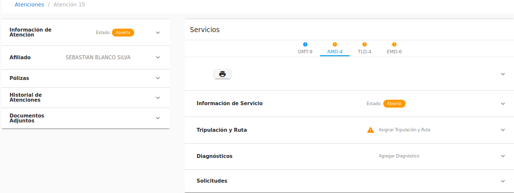
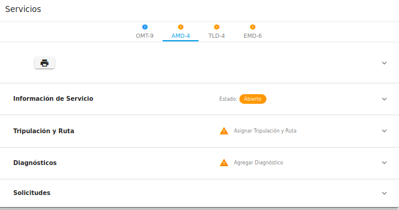
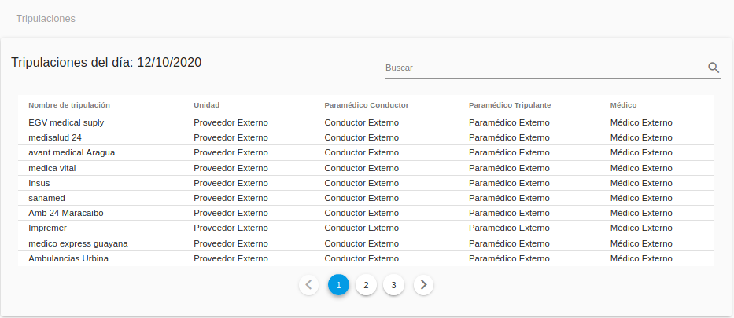
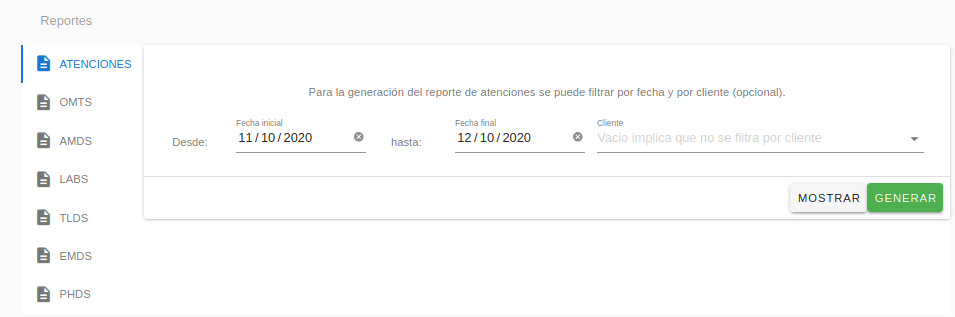
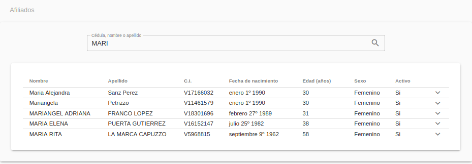
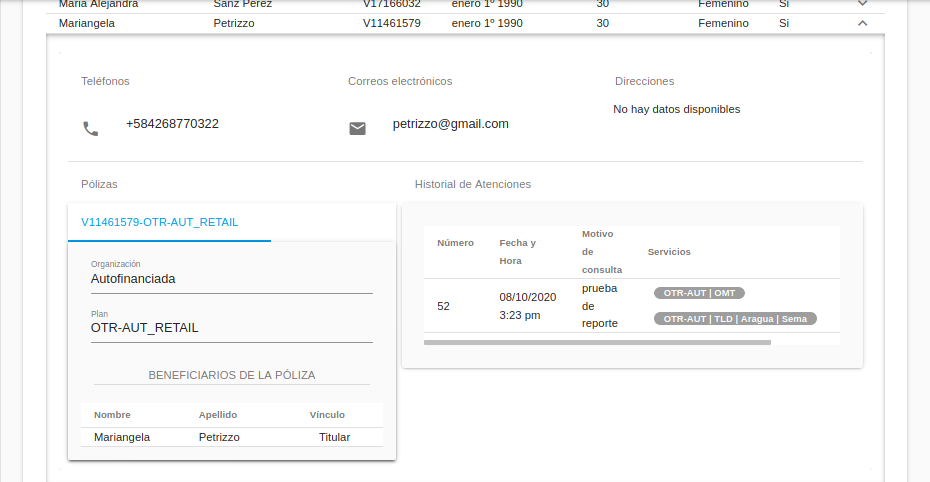

Asistente
=========

El Asistente es la persona que apoya a la gerencia en su gestión para obtener
cualquier información concerniente a las atenciones, servicios, afiliados y/o
tripulaciones de Atención-1. Recuerda que si quieres conocer los conceptos 
utilizados en la plataforma Atención-1, puedes revisar este :ref:`glosario` 
que hemos preparado.

Para ingresar a la plataforma como Asistente, debes escribir en la barra de 
dirección del navegador: https://atencion1.venedigital.com. Una vez allí ves en 
la barra inferior información acerca de Atención-1, un enlace con ayuda que
contendrá un manual, una guía de Preguntas Frecuentes y enlace a un correo 
electrónico con el que se podrá contactar al equipo de desarrollo.

Previamente, el personal encargado de la administración del sistema Atención-1 
es el encargado de crearte el usuario con el rol de Asistente para poder ingresar 
al sistema.

Para ingresar debes indicar el nombre y contraseña del usuario, en este caso 
Asistente. Una vez dentro de la plataforma, puedes apreciar en la parte superior 
derecha, el acceso a los datos del perfil del usuario que acabas de ingresar. Del 
lado superior izquierdo el menú de "hamburguesa," donde puedes acceder más 
fácilmente al panel de atenciones, tripulaciones, afiliados y generación de reportes. 
Y en la parte central, se muestra el panel de atenciones dividido en cuatro secciones:

#. Atenciones **En espera**: atenciones abiertas sin servicios o con al menos un servicio abierto o retrasado.
#. Atenciones **Próximas programadas**: atenciones abiertas con al menos un servicio programado dentro de las próximas 24 horas (incluye PHDs y servicios AMD/LAB/TLD/EMD programados).
#. Atenciones **En progreso**: atenciones abiertas con al menos un servicio que actualmente está siendo atendido.
#. Atenciones **Por cerrar**: atenciones abiertas que contienen al menos un servicio completado o cancelado (por cerrar).

.. image:: ../images/Asistente/AsistentePanelAtencionesGeneral.png

Para visualizar la información del listado de **Atenciones**, en el extremo 
derecho del listado de atenciones haces clic sobre el ícono en la linea contentiva 
de la atención a revisar, el cursor sobre el ícono despliega el mensaje Mostrar.

Una vez seleccionada la atención, aparecen dos secciones en columnas de páneles:

La sección del lado izquierdo contiene en paneles los datos importantes de la 
atención: panel de información general de la atención, panel de datos relevantes 
del afiliado atendido, panel de información general de las pólizas asociadas al 
afiliado, panel del historial de atenciones y el panel de documentos adjuntos 
solicitados para los procesos propios de cada servicio de la atención.

La sección del lado derecho muestra la información referente a los servicios 
contenidos en la atención. Cada servicio se muestra, con los acrónimos de sus 
nombres, en pestañas sobre las que haces clic y despliegan en paneles la 
información de cada servicio:

La cantidad y tipo de paneles se muestran según el servicio: panel de información 
general del servicio, panel de tripulación y rutas, panel de diagnóstico, panel 
de generación de nota de despacho, entre otros.

Todos los paneles (de atención o de servicios) se abren y se cierran al hacer 
clic sobre el borde superior de cada compartimiento, donde se encuentra el 
título del pánel.

Generar Ticket de Servicio
--------------------------

Como usuario con rol de Asistente, en esta pantalla podrás visualizar todos 
los datos y detalles de una atención y su contenido en servicios. Mientras que 
para obtener el documento que contiene la información de cada servicio, el 
ticket de servicio, debajo de las pestañas con los acrónimos de los servicios se 
encuentra el primer panel con el ícono de una impresora, al cual haces clic para 
generar el .pdf con toda la información al día del servicio seleccionado.

Hasta acá se describen las posibilidades de acción de un Asistente dentro de 
Atenciones, item dentro del menú de "hamburguesa" dispuesto en el rincón superior 
izquierdo ya descrito. En dicho menú se tienen los siguientes items:

Generar Ticket de Tripulación
-----------------------------

Al hacer clic en el menú al item **Tripulaciones** puedes visualizar el listado 
de tripulaciones activas. Dispones de un campo de búsquedas en la parte superior 
derecha del listado para localizar una tripulación en específico. 

Cuando haces clic sobre cualquier fila del listado, se despliega un diálogo con 
los Detalles de Tripulación donde encuentras toda la información que engloba una 
tripulación conformada. 

Esta información la puedes imprimir haciendo clic en el ícono de impresora en 
la esquina inferior derecha del diálogo.

.. _generarReportes:

Generar Reportes
----------------

En el item **Reportes** del menú se muestra la bandeja de generación de reportes 
para atenciones y servicios. En los campos de búsqueda se puede filtrar por fecha 
de inicio y fin de creación de la atención y/o servicio así también como por Cliente.

Se dispone de dos botones, uno para mostrar los datos en un listado en la 
parte inferior de la pantalla. Dependiendo de la cantidad de registros que 
tenga el reporte, mayos a 10 registros, se despliega una paginación. Además se 
cuenta con un campo de búsqueda en la parte superior derecha para ubicar con 
facilidad cualquier dato.

y otro botón para generar un archivo .xlsx con los datos.

.. _visualizarAfiliados:

Visualizar Afiliados
--------------------

Finalmente, el item **Afiliados** del menú permite hacer búsquedas por cédula, 
nombre y/o apellido de afiliados. Cuándo realizas una búsqueda, se muestran los 
afiliados que coincidan con los datos buscados en un listado. 

Para visualizar la información de cada afiliado, haces clic en el combo desplegable 
al extremo derecho de la fila que deseas ver. De cada afiliado puedes obtener sus datos 
personales, información sobre pólizas e historial de atenciones. 

