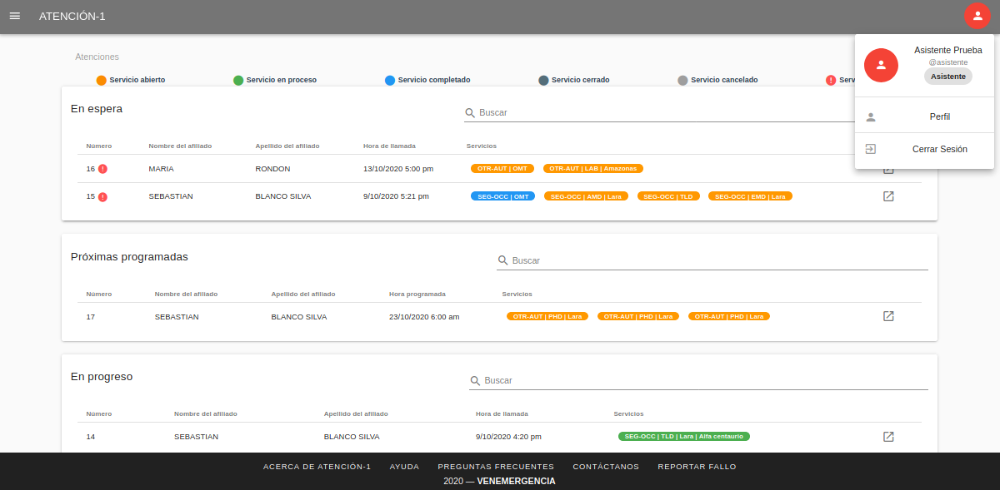
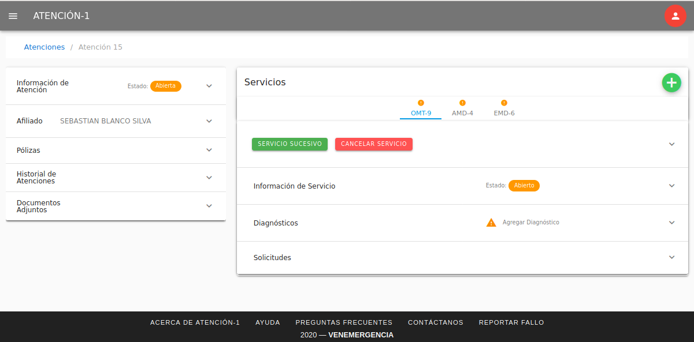
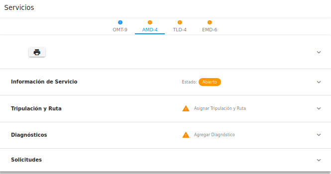

##########
Director/a
##########

El Director es la persona que tiene la posibilidad de generar, monitorear y 
controlar los procesos en la plataforma de Atención-1. 
Recuerda que si quieres conocer los conceptos utilizados en la plataforma 
Atención-1, puedes revisar este :ref:`glosario` 
que hemos preparado.

Para ingresar a la plataforma como Director, debes escribir en la barra de dirección 
del navegador: https://atencion1.venedigital.com. Una vez allí ves en la barra 
inferior información acerca de Atención-1, un enlace con ayuda que contendrá un 
manual, una guía de Preguntas Frecuentes y enlace a un correo electrónico con el 
que se podrá contactar al equipo de desarrollo.

Previamente, el personal encargado de la administración del sistema Atención-1 
es el encargado de crearte el usuario con el rol de Director para poder ingresar 
al sistema.

Para ingresar debes indicar el nombre y contraseña del usuario, en este caso 
Director. Una vez dentro de la plataforma, puedes apreciar en la parte superior 
derecha, el acceso a los datos del perfil del usuario que acabas de ingresar. Del 
lado superior izquierdo el menú de "hamburguesa," donde puedes acceder más 
fácilmente al panel de atenciones, tripulaciones, afiliados y generación de reportes. 
Y en la parte central, se muestra el panel de atenciones dividido en cuatro secciones:

#. Atenciones **En espera**: atenciones abiertas sin servicios o con al menos un servicio abierto o retrasado.
#. Atenciones **Próximas programadas**: atenciones abiertas con al menos un servicio programado dentro de las próximas 24 horas (incluye PHDs y servicios AMD/LAB/TLD/EMD programados).
#. Atenciones **En progreso**: atenciones abiertas con al menos un servicio que actualmente está siendo atendido.
#. Atenciones **Por cerrar**: atenciones abiertas que contienen al menos un servicio completado o cancelado (por cerrar).

Para visualizar la información del listado de **Atenciones**, en el extremo 
derecho del listado de atenciones haces clic sobre el ícono en la linea contentiva 
de la atención a revisar, el cursor sobre el ícono despliega el mensaje Revisar.

Una vez seleccionada la atención, aparecen dos secciones en columnas de páneles:

La sección del lado izquierdo contiene en paneles los datos importantes de la 
atención: panel de información general de la atención, panel de datos relevantes 
del afiliado atendido, panel de información general de las pólizas asociadas al 
afiliado, panel del historial de atenciones y el panel de documentos adjuntos 
solicitados para los procesos propios de cada servicio de la atención. Con el 
rol de Director puedes editar información de los campos editables en el panel 
de Información de Atención y Afiliado.

La sección del lado derecho muestra la información referente a los servicios 
contenidos en la atención. Cada servicio se muestra, con los acrónimos de sus 
nombres, en pestañas sobre las que haces clic y despliegan en paneles la 
información de cada servicio:

La cantidad y tipo de paneles se muestran según el servicio: panel de información 
general del servicio, panel de tripulación y rutas, panel de diagnóstico, panel 
de generación de nota de despacho, entre otros.

Todos los paneles (de atención o de servicios) se abren y se cierran al hacer 
clic sobre el borde superior de cada compartimiento, donde se encuentra el 
título del pánel.

Como Director podrás editar todos los campos que el sistema permite modificar/agregar 
en los paneles de servicios y los de atenciones. Este rol integra todos los permisos 
que tienen los demás roles.

******************
Crear una atención
******************
:ref:`crear-atencion`

*************************
Operaciones con afiliados
*************************
:ref:`operaciones-afiliados`

***********************
Gestionar Tripulaciones
***********************
:ref:`gestionar_tripulaciones`

****************
Generar Reportes
****************
:ref:`generarReportes`

********************
Visualizar Afiliados
********************
:ref:`visualizarAfiliados`